# Раздел 2. Моделирование системы

## 2.1 Методология проектирования и выбор подхода к моделированию

Проектирование обучающей платформы для разработчиков потребовало выбора подхода, адекватного характеру решаемых задач. С учётом того, что система представляет собой веб-приложение с явно выраженными доменными сущностями (пользователь, набор карточек, информационный объект, карточка, состояние карточки), центральной задачей второго этапа проектирования является формализация предметной области и архитектуры системы в виде объектных, структурных и поведенческих моделей.

В качестве основного подхода к проектированию выбрана объектно-ориентированная декомпозиция, которая в наибольшей степени соответствует применяемым в проекте языкам программирования Go и TypeScript [22]. Все структурные и поведенческие модели разработаны в нотации UML 2.5 [23]; схемы алгоритмов представлены в виде блок-схем в соответствии с ГОСТ 19.701-90 [33].

Жизненный цикл разработки строится по итеративной инкрементальной модели, что определяет характер представляемых здесь моделей: они охватывают версию системы в объёме первого итерационного цикла, полностью реализующего функциональное ядро платформы.

Раздел содержит следующие виды моделей:

- объектная модель системы (диаграмма классов UML);
- схема базы данных (ER-модель);
- диаграмма модулей серверной части (диаграмма компонентов UML);
- диаграммы последовательности взаимодействия пользователя с системой;
- диаграмма состояний карточки;
- алгоритмы планировщика повторений (блок-схемы).

---

## 2.2 Требования к системе

### 2.2.1 Функциональные требования

На основании анализа предметной области, проведённого в разделе 1, установлено, что разрабатываемая система должна устранять ограничения существующих решений в области интервального повторения. В отличие от традиционных приложений для работы с карточками, проектируемая платформа ориентирована на обучение разработчиков программного обеспечения, что требует поддержки учебного контента, содержащего текстовые пояснения и фрагменты исходного кода. Кроме того, система должна реализовывать научно обоснованный алгоритм планирования повторений FSRS, учитывать зависимости между учебными элементами и обеспечивать автоматическую генерацию контента на основе больших языковых моделей. Следовательно, функциональные требования должны охватывать полный цикл взаимодействия пользователя с платформой: от регистрации и создания учебного материала до прохождения сессий повторения, получения адаптивного расписания и анализа прогресса.

Функциональные требования целесообразно разделить на пять групп: требования к управлению пользователями, требования к управлению учебным контентом, требования к проведению повторений, требования к автоматической генерации материала и требования к анализу результатов обучения. Такое разбиение соответствует выявленным в разделе 1 особенностям предметной области и отражает структуру проектируемой системы.

**FR-01. Управление пользователями.** Система должна обеспечивать регистрацию нового пользователя, аутентификацию по адресу электронной почты и паролю, а также хранение и обновление данных профиля. Для каждого пользователя должны сохраняться адрес электронной почты, хеш пароля, предпочтительный язык интерфейса и служебные метки времени создания и изменения записи. После успешной аутентификации пользователь должен получать доступ только к принадлежащим ему учебным сущностям и результатам повторений.

**FR-02. Управление наборами карточек (колодами).** Аутентифицированный пользователь должен иметь возможность создавать, просматривать, редактировать и удалять колоды. Каждая колода должна содержать заголовок, описание и языковой код учебного контента, определяющий язык вложенных информационных объектов и карточек. Система должна обеспечивать отображение списка колод пользователя и открытие каждой колоды для дальнейшей работы с её содержимым.

**FR-03. Управление информационными объектами.** В рамках колоды пользователь должен иметь возможность создавать, просматривать, редактировать и удалять информационные объекты. Информационный объект представляет собой структурную единицу учебного материала, содержащую справочный текст или фрагмент программного кода, служащий контекстом для связанного набора карточек. Система должна обеспечивать однозначную связь каждого информационного объекта с конкретной колодой и использовать его содержимое при отображении карточек и подсветке релевантных строк.

**FR-04. Управление карточками.** В рамках информационного объекта пользователь должен иметь возможность создавать, просматривать, редактировать и удалять карточки. Карточка должна содержать текст вопроса, одну или несколько правильных последовательностей токенов ответа, набор токенов-дистракторов, номер шага разблокировки и список номеров строк для подсветки в справочном контенте. После сохранения карточка должна становиться доступной для включения в учебный процесс в соответствии с правилами формирования сессии и механизмом пошагового разблокирования.

**FR-05. Токен-ориентированный механизм ответа.** При предъявлении карточки система должна отображать пользователю перемешанный набор токенов, включающий как правильные элементы ответа, так и дистракторы. Пользователь должен формировать ответ путём последовательного выбора токенов в предполагаемом правильном порядке. Результат попытки, выбранная последовательность, оценка правильности и сопутствующие метаданные должны фиксироваться на клиентской стороне и передаваться на сервер для последующей обработки.

**FR-06. Сессия повторений.** Система должна формировать для пользователя текущую сессию повторений как упорядоченный список карточек, подлежащих изучению или повторению. В состав сессии должны включаться просроченные карточки в состояниях learning, review и relearning, а также новые карточки, доступ к которым открыт механизмом пошагового разблокирования. Система должна обеспечивать получение актуального состава сессии на момент запроса с учётом текущих состояний карточек пользователя.

**FR-07. Планирование повторений по алгоритму FSRS.** После каждого ответа система должна автоматически вычислять рейтинг ответа и обновлять параметры состояния карточки в соответствии с алгоритмом FSRS. Обновлению подлежат показатели сложности, стабильности и извлекаемости, а также дата следующего повторения, интервал и текущий статус карточки. Расчёт нового состояния должен выполняться без участия пользователя и использоваться при последующем формировании сессий повторения.

**FR-08. Механизм пошагового разблокирования.** Карточки, относящиеся к одному информационному объекту, должны быть разделены на шаги изучения (`step 0`, `step 1`, `step 2` и далее), отражающие последовательность перехода от базовых понятий к более сложным. Карточки шага `N` должны становиться доступными только после того, как все карточки шага `N-1` достигнут установленного порога усвоения, выраженного через стабильность памяти `S >= 14` дней. Система должна автоматически проверять выполнение этого условия при формировании сессии и после каждого обновления состояний карточек.

**FR-09. Автоматическая генерация контента.** Система должна предоставлять конечную точку, принимающую на вход тему или произвольный фрагмент учебного текста и возвращающую структурированный результат генерации. Результат должен включать набор информационных объектов и связанных с ними карточек, сформированных с использованием большой языковой модели в соответствии с моделью данных платформы. Пользователь должен иметь возможность использовать сгенерированный материал как основу для дальнейшего редактирования и включения в учебный процесс.

**FR-10. Статистика прогресса.** Система должна предоставлять пользователю средства анализа результатов обучения на уровне колоды и отдельной карточки. Для колоды должна формироваться агрегированная статистика, отражающая распределение карточек по уровням освоения или статусам изучения, а для отдельной карточки - история повторений с сохранением результатов предыдущих ответов. Указанные данные должны использоваться для визуализации прогресса и оценки динамики обучения.

**FR-11. Многоязычный интерфейс.** Пользовательский интерфейс системы должен поддерживать смену языка без изменения логики работы приложения. Все текстовые строки интерфейса должны загружаться из словарей локализации, а выбранный язык интерфейса должен определяться значением поля `preferredLanguage` профиля пользователя с возможностью последующего изменения. Язык интерфейса должен быть независим от языка учебного контента, задаваемого на уровне колоды.

### 2.2.2 Нефункциональные требования

**NFR-01. Производительность.** Запрос сессии повторений и отправка ответа должны выполняться за не более чем 300 мс при нагрузке до 100 одновременных пользователей.

**NFR-02. Безопасность.** Аутентификация реализуется посредством JWT с временем жизни 7 дней; пароли хранятся в виде bcrypt-хешей с коэффициентом стоимости 12.

**NFR-03. Расширяемость.** Серверная часть структурирована в виде модульного монолита, допускающего выделение отдельных модулей в микросервисы без существенного рефакторинга.

**NFR-04. Кроссплатформенность.** Клиентская часть должна корректно работать во всех современных браузерах и адаптироваться к мобильным экранам.

**NFR-05. Интернационализация.** Языковой код контента хранится на уровне колоды и наследуется всеми вложенными сущностями. Генерация контента через LLM должна использовать языковой код колоды.

---

## 2.3 Объектная модель системы

### 2.3.0 Верхнеуровневая схема работы приложения

Перед детальным описанием классов приводится верхнеуровневая схема, отражающая взаимодействие основных слоёв системы и ключевые потоки данных между ними.

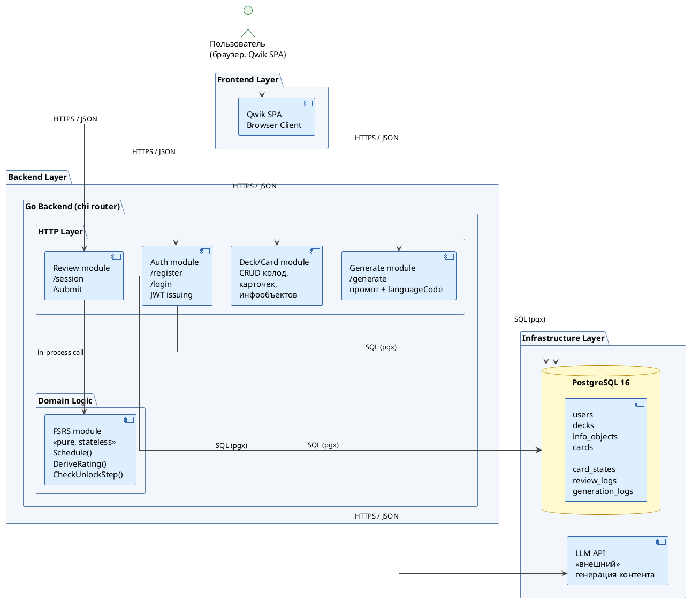

_Рисунок 2.0 — Верхнеуровневая схема работы приложения. Клиентская SPA взаимодействует с бэкендом исключительно через REST API. Модуль FSRS является stateless-ядром без I/O, вызываемым только из Review module. Генерация контента делегируется внешнему LLM API с фиксацией всех обращений в БД._

### 2.3.1 Диаграмма классов

Объектная модель системы включает следующие основные классы предметной области: `User`, `Deck`, `InfoObject`, `Card`, `CardState`, `ReviewLog`, `GenerationLog`. Помимо доменных классов, в систему входят служебные классы алгоритмического ядра: `Scheduler` и `FSRSWeights`, а также вспомогательные перечислимые типы `Rating` и `CardStatus`.

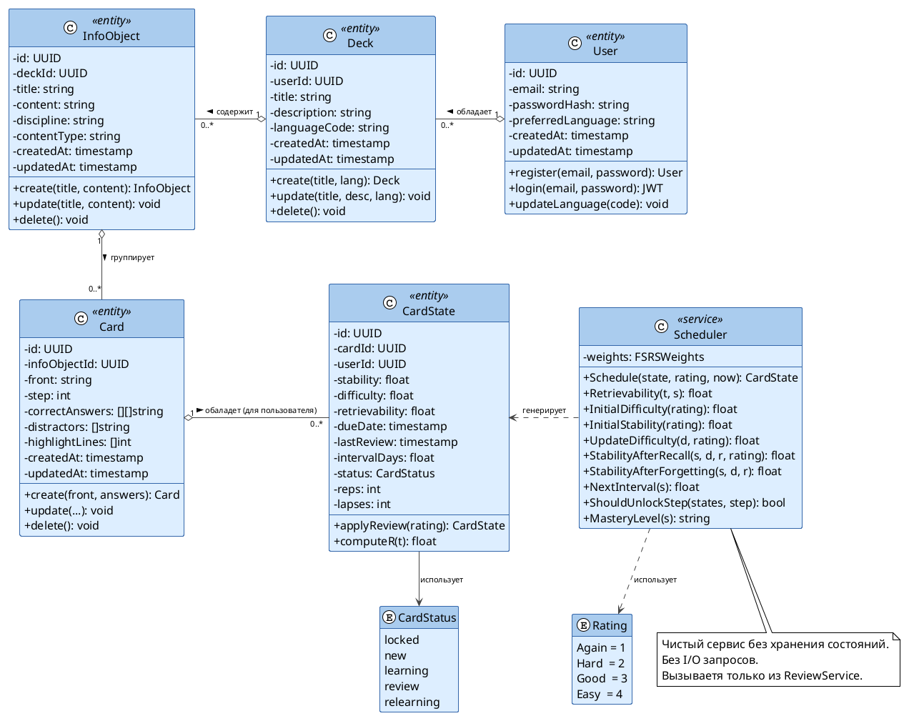

_Рисунок 2.1 — Диаграмма классов предметной области. Агрегации (o--) отражают иерархию владения: User → Deck → InfoObject → Card → CardState. Класс Scheduler является чистым сервисом без состояния и I/O._

### 2.3.2 Пояснение к объектной модели

Иерархия `User → Deck → InfoObject → Card → CardState` отражает логику владения данными в системе. Пользователь владеет набором колод; каждая колода содержит информационные объекты; каждый информационный объект группирует карточки по тематическому принципу. Ключевым архитектурным решением является разделение инвариантного описания карточки (класс `Card`) и изменяемого состояния FSRS (класс `CardState`): одна и та же карточка может находиться в разных состояниях у разных пользователей, что обеспечивает корректную работу в многопользовательском режиме без дублирования контента.

С точки зрения разрабатываемого алгоритма класс `InfoObject` выполняет роль корневой вершины **инфо-графа** — ориентированного графа, вершины которого соответствуют отдельным аспектам знания об изучаемом объекте, а рёбра — отношениям «необходимо знать прежде, чем». Класс `Card` представляет отдельную вершину этого графа, то есть конкретную грань сложного понятия. Номер шага (`step`) задаёт уровень графа: вершины одного уровня могут усваиваться параллельно, тогда как переход к следующему уровню возможен лишь после достаточного закрепления всех вершин текущего уровня. Именно такая декомпозиция позволяет формализовать гетерогенность учебного объекта: разные карточки одного `InfoObject` могут проверять принципиально различные типы знания — определение, применение, реализацию в коде — и обладать различным уровнем сложности `D`, характеризующим трудность именно данной грани. В предлагаемой модификации FSRS данная трудность рассматривается в двух формах: как **базовая сложность** отдельной карточки, определяемая её собственной историей повторений, и как **эффективная сложность** $D_{eff}$, дополнительно зависящая от степени усвоения предшествующих вершин того же инфо-графа.

Класс `Scheduler` намеренно не содержит состояния и не обращается к базе данных. Это обеспечивает детерминированность алгоритма: при одинаковых входных данных (параметры состояния карточки, рейтинг ответа, метка времени) всегда возвращается идентичный результат. Такая архитектура позволяет проводить полное юнит-тестирование алгоритма без развёртывания тестовой инфраструктуры [24].

---

## 2.4 Схема базы данных

База данных реализована на СУБД PostgreSQL 16. Все идентификаторы используют тип UUID, генерируемый встроенной функцией `gen_random_uuid()`. Миграции управляются инструментом `golang-migrate/migrate`. Схема включает шесть основных таблиц: `users`, `decks`, `info_objects`, `cards`, `card_states`, `review_logs`, а также вспомогательную таблицу `generation_logs`.

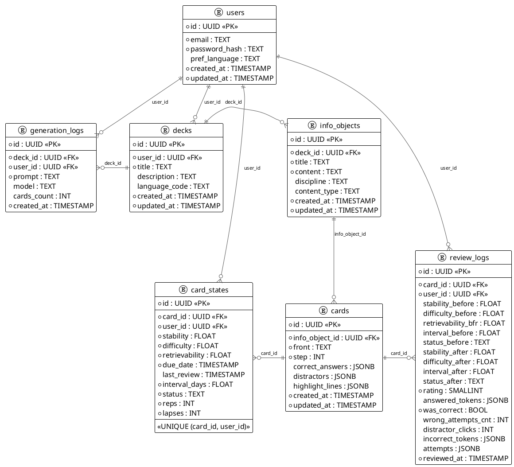

_Рисунок 2.3 — ER-диаграмма схемы базы данных. `*` — обязательное поле. PK — первичный ключ, FK — внешний ключ. Таблица `card_states` связана как с `cards`, так и с `users`, реализуя пару (карточка, пользователь) с уникальным ограничением UNIQUE (card_id, user_id). Таблица `review_logs` — неизменяемый журнал всех событий повторения. Таблица `generation_logs` фиксирует все обращения к LLM._

### 2.4.1 Пояснение к схеме данных

Центральным решением в схеме базы данных является отделение таблицы `card_states` от таблицы `cards`. Таблица `cards` хранит неизменяемое описание карточки — вопрос, правильные ответы, дистракторы, номер шага. Таблица `card_states` хранит индивидуальное состояние алгоритма FSRS для конкретной пары (карточка, пользователь). Данная структура обеспечивает несколько важных свойств: один и тот же контент может использоваться несколькими пользователями с независимыми траекториями обучения; история повторений в `review_logs` позволяет в будущем реализовать дообучение весовых коэффициентов FSRS под конкретного пользователя; генерация контента фиксируется в `generation_logs` с полным текстом промпта, что обеспечивает возможность аудита.

Поля типа JSONB (`correct_answers`, `distractors`, `highlight_lines`, `answered_tokens`, `attempts`) выбраны для хранения структурированных массивов переменной длины, что устраняет необходимость введения дополнительных связующих таблиц и сохраняет возможность выполнения запросов к их содержимому средствами PostgreSQL [25].

Индексы, критичные для производительности сессии повторений:

- `idx_card_states_due` — составной индекс по `(user_id, due_date)` с частичным предикатом `status IN ('learning', 'review', 'relearning')` — обеспечивает быстрый выбор просроченных карточек;
- `idx_card_states_user_status` — по `(user_id, status)` — обеспечивает выбор новых карточек;
- `idx_cards_step` — по `(info_object_id, step)` — обеспечивает быструю проверку условий разблокировки шага.

---

## 2.5 Диаграмма модулей серверной части

Серверная часть реализована как модульный монолит на языке Go. Модульный монолит — это архитектурный стиль, при котором приложение развёртывается как единый процесс, однако внутренние границы между модулями проведены достаточно явно, чтобы при необходимости выделить отдельные модули в самостоятельные сервисы без существенного рефакторинга [26]. Взаимодействие между модулями осуществляется исключительно через Go-интерфейсы, что предотвращает нежелательные связи между реализациями.

```
@startuml backend_modules
!theme plain
skinparam defaultFontName Arial
skinparam defaultFontSize 12
skinparam shadowing false

skinparam componentStyle rectangle
skinparam packageStyle rectangle

skinparam package {
  BackgroundColor #F7F9FC
  BorderColor #6B7A90
}
skinparam component {
  BackgroundColor #DDEEFF
  BorderColor #3366AA
}
skinparam database {
  BackgroundColor #FFF4CC
  BorderColor #B8860B
}
skinparam interface {
  BackgroundColor #E8F5E9
  BorderColor #2E7D32
}
skinparam cloud {
  BackgroundColor #F3E5F5
  BorderColor #7B1FA2
}

package "HTTP Layer" as HTTP {
  component "Router" as Router
  component "Recovery Middleware" as RecoveryMw
  component "Logger Middleware" as LoggerMw
  component "Auth Middleware" as AuthMw
}

package "User Module" as UM {
  component "User Handler" as UserHandler
  component "User Service" as UserService
  component "User Repository" as UserRepo
}

package "Deck Module" as DM {
  component "Deck Handler" as DeckHandler
  component "Deck Service" as DeckService
  component "Deck Repository" as DeckRepo
}

package "Card Module" as CM {
  component "Card Handler" as CardHandler
  component "Card Service" as CardService
  component "Card Repository" as CardRepo
}

package "Review Module" as RM {
  component "Review Handler" as ReviewHandler
  component "Review Service" as ReviewService
  component "Review Repository" as ReviewRepo
}

package "FSRS Module" as FM {
  component "Scheduler" as Scheduler
}

package "Generate Module" as GM {
  component "Generate Handler" as GenerateHandler
  component "Generate Service" as GenerateService
}

package "Infra" {
  component "Config" as Config
  component "Postgres Pool" as PostgresPool
}

database "PostgreSQL" as Postgres
cloud "LLM API" as LLM

Router --> UserHandler
Router --> DeckHandler
Router --> CardHandler
Router --> ReviewHandler
Router --> GenerateHandler

UserHandler --> UserService
UserService --> UserRepo

DeckHandler --> DeckService
DeckService --> DeckRepo
DeckService --> UserRepo : запрос предпочитаемого языка

CardHandler --> CardService
CardService --> CardRepo

ReviewHandler --> ReviewService
ReviewService --> ReviewRepo
ReviewService --> Scheduler

GenerateHandler --> GenerateService
GenerateService --> LLM

UserRepo --> PostgresPool
DeckRepo --> PostgresPool
CardRepo --> PostgresPool
ReviewRepo --> PostgresPool
PostgresPool --> Postgres

Router -[hidden]down-> UM
Router -[hidden]down-> CM
Router -[hidden]down-> DM
Router -[hidden]down-> GM
Router -[hidden]down-> RM

AuthMw -[hidden]down-> UM
AuthMw -[hidden]down-> CM
AuthMw -[hidden]down-> DM
AuthMw -[hidden]down-> GM
AuthMw -[hidden]down-> RM

@enduml
```

_Рисунок 2.5 — Диаграмма компонентов серверной части (UML Component Diagram). Каждый доменный модуль имеет одинаковую внутреннюю структуру из четырёх файлов: model, repository, service, handler. Модуль fsrs не имеет зависимостей на уровне I/O и вызывается только из review.ReviewService._

### 2.5.1 Пояснение к модульной структуре

Каждый доменный модуль (`user`, `deck`, `card`, `review`, `generate`) организован по единой схеме из четырёх файлов: `model.go` содержит доменные структуры; `repository.go` — интерфейс репозитория и его реализацию через `pgx`; `service.go` — бизнес-логику, оперирующую репозиторием через интерфейс; `handler.go` — HTTP-обработчики, вызывающие методы сервиса.

Такая структура обеспечивает несколько архитектурных свойств. Во-первых, тестируемость: сервис может быть протестирован с мок-репозиторием без подключения к базе данных. Во-вторых, заменяемость инфраструктуры: реализацию `pgx`-репозитория можно заменить, например, in-memory-реализацией для тестов, не изменяя ни одной строки бизнес-логики. В-третьих, явные границы модулей: модуль `review` не импортирует конкретные типы из модуля `card` напрямую; вместо этого он объявляет интерфейс `CardStateReader`, который реализует `card.CardRepository` [24].

Модуль `generate` взаимодействует с внешним API Anthropic через HTTP-клиент. Промпт конструируется с учётом языкового кода целевой колоды (`deck.languageCode`), что гарантирует генерацию вопросов, ответов и дистракторов на нужном языке. Все обращения к LLM фиксируются в таблице `generation_logs` с полным текстом промпта, использованной моделью и числом созданных карточек.

---

## 2.6 Диаграммы последовательности взаимодействия пользователя с системой

### 2.6.1 Сценарий регистрации и аутентификации

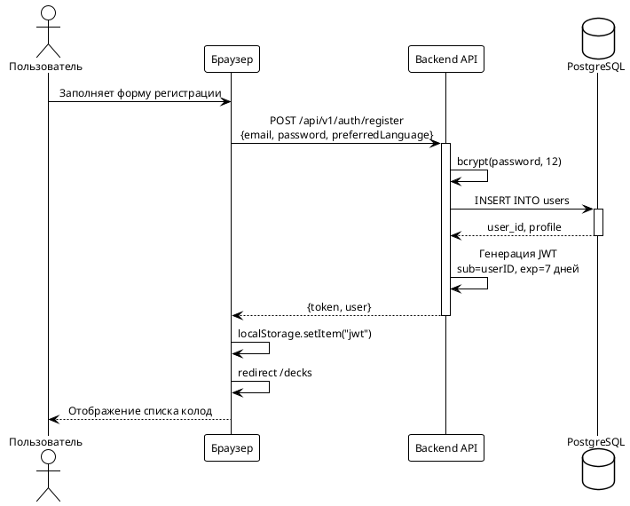

_Рисунок 2.6 — Диаграмма последовательности: регистрация пользователя. Пароль хешируется на стороне сервера алгоритмом bcrypt с коэффициентом стоимости 12; JWT хранится в localStorage браузера._

### 2.6.2 Сценарий сессии повторений

Сессия повторений является ключевым пользовательским сценарием в системе. Диаграмма охватывает полный цикл: от загрузки карточек до отправки ответа и обновления состояния FSRS с последующей проверкой условий разблокировки следующего шага.

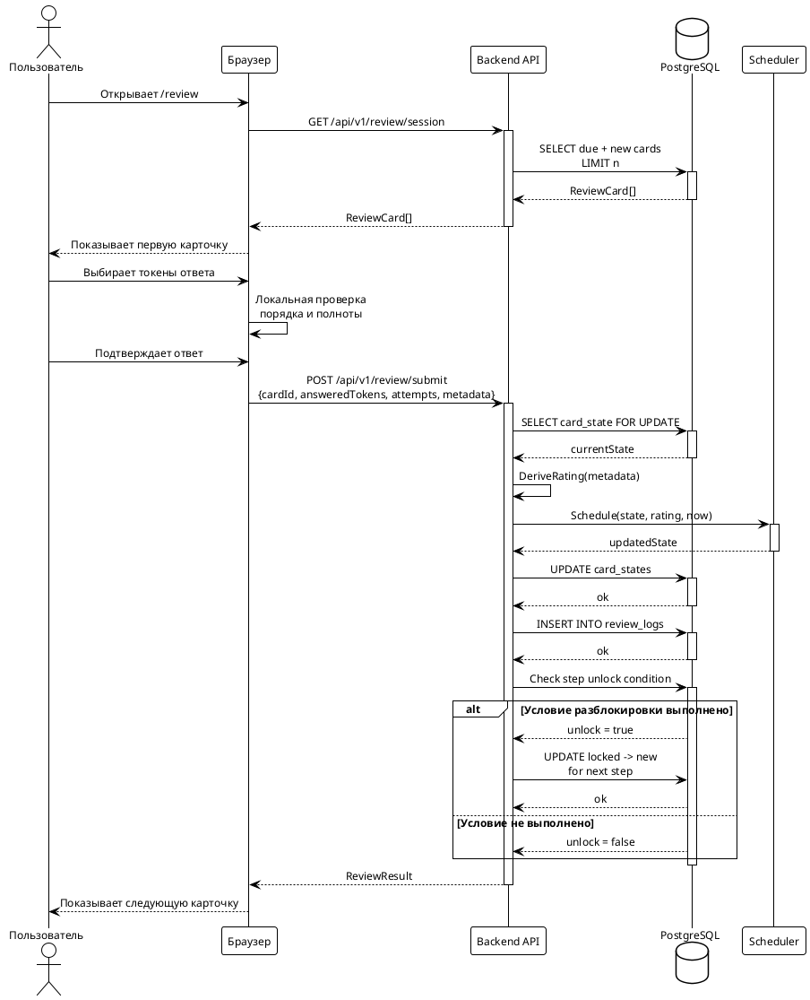

_Рисунок 2.7 — Диаграмма последовательности: сессия повторений. Рейтинг ответа (Again/Hard/Good/Easy) выводится автоматически из метаданных взаимодействия; явного выбора пользователем не требуется. После каждого обновления card_states проверяются условия разблокировки следующего шага._

### 2.6.3 Сценарий автоматической генерации учебного контента

Данный сценарий охватывает процесс автоматической генерации карточек на основе темы или исходного текста, предоставленного пользователем. Важным аспектом является включение языкового кода колоды в промпт для LLM, что обеспечивает генерацию контента на нужном языке.

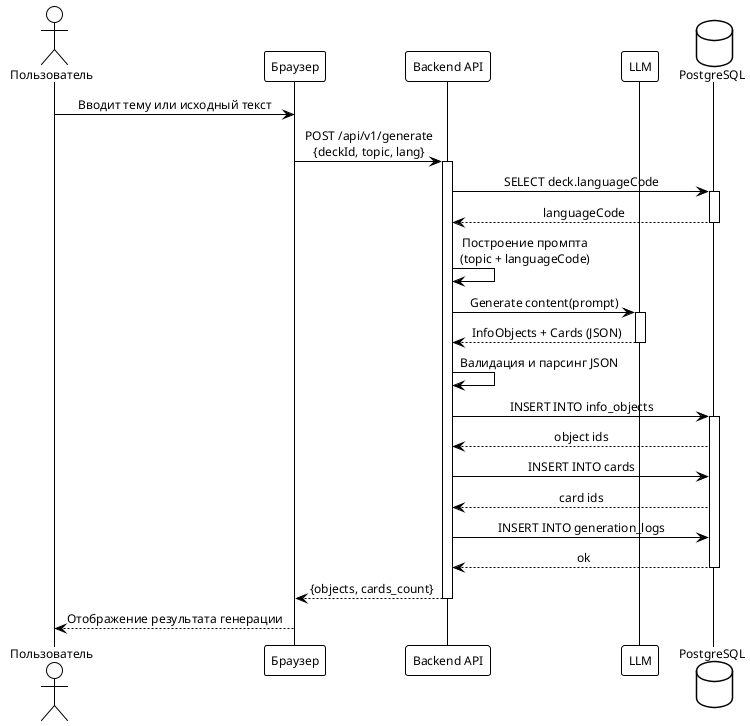

_Рисунок 2.8 — Диаграмма последовательности: автоматическая генерация учебного контента. Промпт явно включает языковой код колоды, что обеспечивает соответствие сгенерированного контента целевому языку обучения. Все запросы к LLM фиксируются в generation_logs._

---

## 2.7 Диаграмма состояний карточки

Каждая карточка в системе в разрезе конкретного пользователя находится в одном из пяти состояний: `locked`, `new`, `learning`, `review`, `relearning`. Переходы между состояниями определяются результатами повторений и механизмом пошагового разблокирования.

```plantuml
@startuml card_state_machine
!theme plain
skinparam defaultFontName Arial
skinparam defaultFontSize 12
skinparam shadowing false

skinparam state {
  BackgroundColor #DDEEFF
  BorderColor #3366AA
  FontStyle bold
}
skinparam arrow {
  Color #444444
  FontSize 11
}

hide empty description

[*] --> LOCKED : step > 0
[*] --> NEW : step = 0

state LOCKED : Шаг N > 0\nВсе карточки шага N-1\nещё не достигли S >= 14 дней
state NEW : Доступна для первого\nповторения
state LEARNING : S < 21 дня\nКарточка в процессе\nзаучивания
state REVIEW : S >= 21 дней\nУстойчивое долгосрочное\nзапоминание
state RELEARNING : Ошибка после REVIEW\nПереучивание

LOCKED --> NEW : Все карточки шага N-1\nдостигли S >= 14 дней
NEW --> LEARNING : Первое повторение
LEARNING --> REVIEW : rating != Again\nи S >= 21 дней
LEARNING --> LEARNING : rating = Again
REVIEW --> RELEARNING : rating = Again\nlapses++
RELEARNING --> LEARNING : rating != Again
RELEARNING --> RELEARNING : rating = Again

LOCKED -[hidden]right->
@enduml
```

_Рисунок 2.9 — Диаграмма состояний карточки (UML State Machine Diagram). Переход из LOCKED в NEW инициируется системой автоматически после достижения всеми карточками предыдущего шага порога стабильности S ≥ 14 дней. Граница между LEARNING и REVIEW установлена на значении S = 21 день._

### 2.7.1 Пояснение к диаграмме состояний

Введение порога перехода в статус `review` на уровне S = 21 дня означает, что карточка считается долгосрочно усвоенной лишь при достижении трёхнедельного горизонта запоминания. На практике это соответствует 3–4 успешным повторениям для материала среднего уровня сложности при использовании предобученных весовых коэффициентов FSRS.

Статус `relearning` отличается от `learning` тем, что переход в него из `review` сопровождается инкрементом счётчика `lapses`. Данный счётчик отражает число «срывов» памяти после достижения долгосрочного запоминания и используется в статистических отчётах для выявления материала с аномально высокой скоростью забывания. В будущих итерациях разработки данные `lapses` могут быть задействованы для коррекции весовых коэффициентов в персонализированном режиме оптимизации FSRS [31].

Механизм пошагового разблокирования (`locked → new`) реализует на уровне машины состояний обход рёбер инфо-графа (см. подраздел 2.8.1): переход ребра $e_{ij}$ из «заблокированного» в «активное» состояние происходит в тот момент, когда все вершины-предшественники $v_i$ достигают порогового значения стабильности $S \geq 14$ дней. Это соответствует обоснованной в разделе 1 идее о том, что освоение сложных граней учебного объекта должно начинаться только после достаточного закрепления базовых: физическое ограничение доступа к карточкам следующего шага исключает преждевременную когнитивную нагрузку, обусловленную обращением к незакреплённым предварительным знаниям [13]. При освоенных на достаточном уровне базовых гранях обучающийся получает фундамент для дальнейшего изучения, что облегчает интеграцию новых знаний и способствует формированию более устойчивых долговременных представлений [12]. После разблокировки действует более тонкий механизм: темп дальнейшего роста интервалов определяется уже не только собственной историей повторений карточки, но и эффективной сложностью $D_{eff}$, зависящей от качества усвоения предшествующих шагов.

---

## 2.8 Алгоритмы планировщика повторений

В данном подразделе приводится полное описание алгоритмов планировщика повторений, реализованного в системе. Алгоритм представляет собой адаптацию FSRS (Free Spaced Repetition Scheduler) с двумя собственными модификациями: во-первых, автоматическим выводом рейтинга из метаданных взаимодействия вместо явной самооценки пользователя; во-вторых, введением модели **гетерогенного информационного объекта** и эффективной сложности карточки $D_{eff}$, зависящей от качества усвоения предшествующих вершин инфо-графа [31, 32].

### 2.8.1 Модель гетерогенного информационного объекта

Алгоритмы SM и FSRS эволюционировали в направлении всё более полного учёта свойств информационного объекта: если алгоритм SM-2 оперировал единственным параметром EF, то FSRS уже явно вычисляет сложность D и обновляет её после каждого повторения. Тем не менее в обоих случаях объект изучения трактуется как **гомогенная** единица информации, полностью описываемая парой «вопрос — ответ», то есть ориентированным графом с двумя вершинами.

Практика показывает, что значительная часть учебного материала — особенно в области программирования — представляет собой **гетерогенные** информационные объекты, полное освоение которых требует запоминания нескольких принципиально различных граней. Приведём два характерных примера.

**Пример 1. Структура данных «связный список»** (дисциплина «Алгоритмы и структуры данных»). Чтобы считать данную структуру данных усвоенной, обучающемуся необходимо:

- знать определение структуры и область её применения;
- знать названия операций и их сигнатуры;
- понимать семантику каждой операции (хотя бы на уровне псевдокода);
- уметь реализовать каждую операцию на изучаемом языке программирования.

Ни одно из перечисленных знаний в отдельности не является достаточным для признания объекта усвоенным.

**Пример 2. Китайское слово 沙漠 (пустыня)** (дисциплина «Китайский язык»). Полное освоение данной лексической единицы требует:

- знания перевода (沙漠 → пустыня);
- знания пиньиня и произношения (shā mò);
- знания состава и значения отдельных иероглифов (沙 — песок, 漠 — пустошь);
- умения прочитать слово при его предъявлении в тексте;
- умения воспроизвести написание каждого иероглифа.

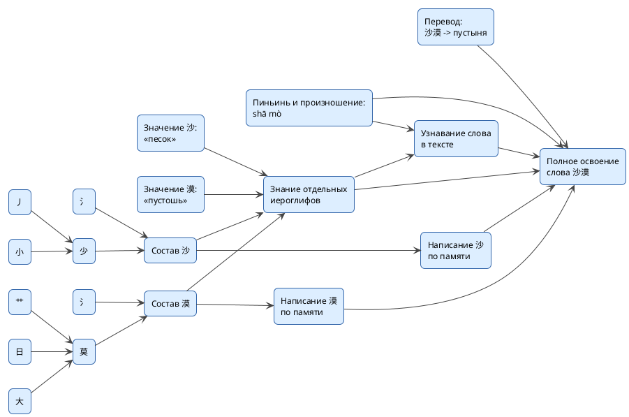

Рисунок - Диаграмма инфо-графа для китайского слова 沙漠. Вершины соответствуют различным аспектам знания, необходимым для полного освоения слова. Рёбра отражают зависимости между этими аспектами.

В языках с фонетическим письмом (французский, турецкий) задача сводится к запоминанию гомогенной пары «иностранное слово — перевод», то есть инфо-граф вырождается в две вершины. Для языков с идеографическим письмом граф существенно сложнее.

Оба приведённых примера демонстрируют ключевое свойство гетерогенного информационного объекта: **его усвоение определяется качеством усвоения всех составляющих его граней**. Нельзя утверждать, что обучающийся знает связный список, если он умеет лишь воспроизвести определение, но не способен реализовать операцию вставки. Аналогично нельзя утверждать, что обучающийся знает слово «пустыня» на китайском, если он знает его звучание, но не может записать иероглифы.

Формально такой объект моделируется как **инфо-граф** $G = (V, E)$, где вершины $v_i \in V$ соответствуют отдельным аспектам знания (каждой вершине соответствует карточка системы), а ориентированные рёбра $e_{ij} \in E$ кодируют зависимость «вершина $v_i$ должна быть усвоена на достаточном уровне, прежде чем начнётся усвоение вершины $v_j$». Понятие «достаточного уровня» формализуется через порог стабильности: вершина $v_i$ считается освоенной для целей разблокировки, если $S_i \geq S_{\min}$ (в реализованной системе $S_{\min} = 14$ дней).

Шаговая структура карточек (`step`) реализует топологическую сортировку инфо-графа: вершины одного шага не имеют рёбер между собой (могут усваиваться параллельно), а все рёбра направлены от вершин шага $n-1$ к вершинам шага $n$. Данное упрощение допустимо для большинства практических случаев и существенно упрощает реализацию механизма разблокировки. Для более сложных топологий граф может быть аппроксимирован цепочкой слоёв с разбиением вершин по уровням обобщённой BFS-обходки.

Параметр сложности $D$, вычисляемый алгоритмом FSRS, в контексте данной модели приобретает новый смысл: он характеризует трудность **конкретной грани** объекта — отдельной вершины инфо-графа. Разные вершины одного и того же объекта закономерно обладают различными значениями $D$: например, для связного списка запомнить определение (шаг 0) значительно проще, чем реализовать удаление узла в коде (шаг 2). Это соответствует эмпирически наблюдаемой неоднородности сложности внутри одной предметной области.

Для превращения данной идеи в конкретную модификацию FSRS вводится понятие **коэффициента иерархической поддержки** текущей карточки. Пусть $c$ — карточка шага $n$, а $Pred(c)$ — множество вершин инфо-графа, непосредственно предшествующих ей. Для каждого предшественника $p \in Pred(c)$ определяется мера его освоения:

$$
M_p = \min\left(\frac{S_p}{S_{ref}}, 1\right), \qquad S_{ref} = 21 \text{ день}. \tag{2.6}
$$

где $M_p$ — мера освоения предшествующей карточки $p$; $S_p$ — текущее значение стабильности предшествующей карточки; $S_{ref}$ — опорное значение стабильности, соответствующее уровню устойчивого долгосрочного запоминания; $p$ — вершина-предшественник текущей карточки в инфо-графе.

Иными словами, если стабильность предшествующей карточки уже достигла уровня устойчивого долгосрочного запоминания, её вклад считается равным единице; при меньшем значении стабильности вклад пропорционально снижается. Тогда коэффициент иерархической поддержки текущей карточки вычисляется как взвешенное среднее по всем её предшественникам:

$$
H_c = \sum_{p \in Pred(c)} w_p M_p, \qquad \sum_{p \in Pred(c)} w_p = 1. \tag{2.7}
$$

где $H_c$ — коэффициент иерархической поддержки карточки $c$; $Pred(c)$ — множество предшествующих карточек для карточки $c$; $w_p$ — вес предшествующей карточки $p$ в суммарной поддержке; $M_p$ — мера освоения предшествующей карточки $p$. Условие $\sum_{p \in Pred(c)} w_p = 1$ означает нормировку весов.

Величина $w_p$ отражает относительную важность предшествующей карточки $p$ для усвоения текущей карточки $c$. В базовом варианте реализации предполагается, что все карточки предыдущего шага одинаково значимы, поэтому для них используются равные веса

$$
w_p = \frac{1}{|Pred(c)|}. \tag{2.7a}
$$

где $|Pred(c)|$ — число предшествующих карточек для карточки $c$. Следовательно, коэффициент иерархической поддержки $H_c$ в базовом варианте представляет собой среднюю степень освоения всех карточек-предшественников. Величина $H_c \in [0, 1]$ интерпретируется как степень опоры текущей карточки на уже сформированную предметную схему: чем выше значение $H_c$, тем лучше усвоены необходимые предпосылки.

Далее вводится **эффективная сложность** карточки:

$$
D_{eff}(c) = D_{base}(c) + \lambda \cdot (1 - H_c), \tag{2.8}
$$

где $D_{eff}(c)$ — эффективная сложность карточки $c$; $D_{base}(c)$ — базовая сложность карточки, вычисленная штатным механизмом FSRS по собственной истории её повторений; $\lambda$ — коэффициент иерархического штрафа; $H_c$ — коэффициент иерархической поддержки карточки $c$.

В реализуемой версии алгоритма параметр $\lambda$ ограничивает максимальное увеличение сложности вследствие слабого усвоения базы; при $H_c = 1$ имеем $D_{eff} = D_{base}$, а при $H_c \rightarrow 0$ сложность возрастает на величину, близкую к $\lambda$.

Тем самым в алгоритм вводится непрерывный механизм учёта структуры знания. Пошаговое разблокирование решает бинарную задачу допуска к следующему уровню: карточка либо может быть предъявлена, либо остаётся заблокированной. Однако после разблокировки интенсивность роста межповторительных интервалов определяется уже не только собственной историей данной карточки, но и качеством усвоения предшествующих шагов. Если база усвоена неравномерно, то текущая карточка рассматривается как более трудная, что приводит к более медленному росту стабильности и, следовательно, к более коротким интервалам повторения.

Таким образом, разрабатываемый алгоритм является развитием FSRS в направлении **более глубокой связи между параметрами алгоритма и структурой информационного объекта**: если FSRS учитывает сложность объекта как скалярную величину, новый алгоритм рассматривает сложность как величину, зависящую не только от собственной истории карточки, но и от степени освоения её предпосылок в инфо-графе.

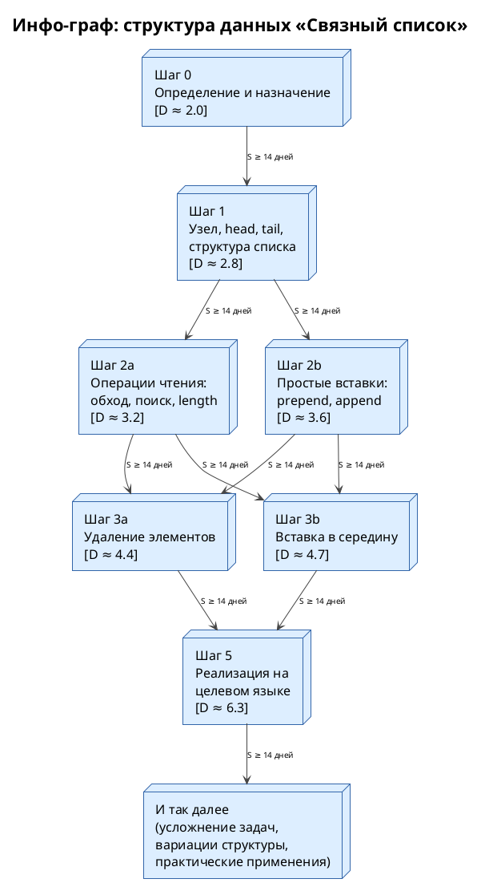

_Рисунок 2.14 — Инфо-граф информационного объекта «Связный список». Вершины соответствуют карточкам системы; рёбра — зависимостям «должно быть усвоено прежде». Значения D отражают различие в сложности граней одного объекта. Вершины шагов 2a и 2b, а также 3a и 3b могут усваиваться параллельно; переход к следующему уровню определяется достижением порога стабильности всеми необходимыми вершинами предыдущего шага._

### 2.8.2 Алгоритм вывода рейтинга из метаданных ответа

В отличие от эталонной реализации FSRS, в которой пользователь явно выбирает оценку (Again/Hard/Good/Easy) после каждого повторения, в данной системе рейтинг выводится автоматически из метаданных взаимодействия пользователя с карточкой. Это исключает субъективность самооценки и обеспечивает воспроизводимость результатов.

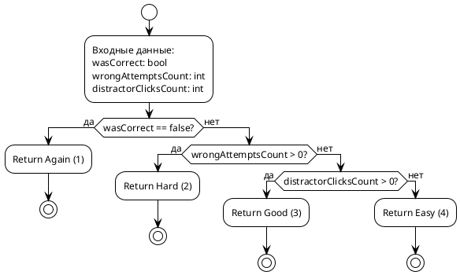

_Рисунок 2.10 — Блок-схема алгоритма вывода рейтинга FSRS из метаданных ответа. Четыре ветви соответствуют стандартным оценкам FSRS: Again (1) — неправильный финальный ответ; Hard (2) — правильный ответ с предшествующими ошибочными попытками; Good (3) — правильный ответ без ошибочных попыток, но с нажатием дистракторов; Easy (4) — правильный ответ с первой попытки без нажатия дистракторов._

### 2.8.3 Алгоритм полного цикла планирования повторения

Метод `Schedule` является центральным алгоритмом системы. Он принимает текущее состояние карточки, выведенный рейтинг, метку времени и коэффициент иерархической поддержки $H_c$; возвращает обновлённое состояние с новыми значениями стабильности S, базовой сложности D, эффективной сложности $D_{eff}$, извлекаемости R и датой следующего повторения. Значение $H_c$ вычисляется на уровне сервисного слоя по состояниям предшествующих карточек и передаётся в `Scheduler` как готовый параметр, что сохраняет чистоту и детерминированность алгоритмического ядра.

Псевдокод алгоритма приведён ниже.

```text
Schedule(state, rating, now, Hc):
    t <- (now - state.lastReview) / 24h
    R <- Retrievability(t, state.stability)

    if rating == Again then
        newS <- StabilityAfterForgetting(state.stability, state.difficulty, R, W)
        newDbase <- UpdateDifficulty(state.difficulty, Again, W)
        if state.status == review then
            lapses <- state.lapses + 1
        else
            lapses <- state.lapses
        end if
        status <- relearning
        reps <- state.reps
    else
        newS <- StabilityAfterRecall(state.stability, state.difficulty, R, rating, W)
        newDbase <- UpdateDifficulty(state.difficulty, rating, W)
        reps <- state.reps + 1
        lapses <- state.lapses

        if newS >= 21 then
            status <- review
        else
            status <- learning
        end if
    end if

    Deff <- Clamp(newDbase + lambda * (1 - Hc), Dmin, Dmax)
    intervalDays <- max(NextInterval(newS, Deff), 1)
    dueDate <- now + intervalDays * 24h
    newR <- Retrievability(0, newS)

    return CardState {
        stability = newS,
        difficulty = newDbase,
        effectiveDifficulty = Deff,
        retrievability = newR,
        intervalDays = intervalDays,
        dueDate = dueDate,
        status = status,
        reps = reps,
        lapses = lapses
    }
```

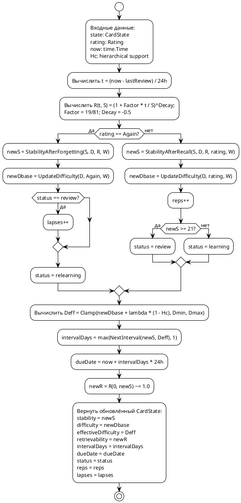

_Рисунок 2.11 — Блок-схема основного алгоритма планировщика FSRS (метод Schedule) в модифицированном варианте. После стандартного обновления базовой сложности `D_base` вычисляется эффективная сложность `D_eff`, зависящая от коэффициента иерархической поддержки `H_c`, определяемого по качеству усвоения предшествующих карточек инфо-объекта. Разветвление по рейтингу определяет применение одной из двух функций обновления стабильности: `StabilityAfterRecall` для правильных ответов или `StabilityAfterForgetting` для ошибочных._

### 2.8.4 Алгоритм пошагового разблокирования карточек

Обработка ответа пользователя представляет собой единую транзакцию, объединяющую три последовательных действия: обновление параметров FSRS в `card_states`, запись события в `review_logs` и проверку условия разблокирования следующего шага. Объединение этих действий в одну транзакцию необходимо по следующей причине: проверка условия разблокирования опирается на обновлённые значения стабильности, поэтому `SELECT` должен видеть результат `UPDATE card_states`, выполненного в той же транзакции. Если какое-либо из трёх действий завершается ошибкой, транзакция откатывается целиком, исключая частично зафиксированное состояние — например, ситуацию, когда `card_states` уже обновлены и `review_logs` записаны, а разблокирование следующего шага не выполнено.

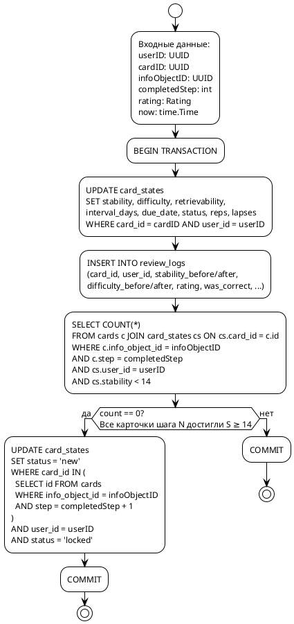

_Рисунок 2.12 — Блок-схема полного транзакционного сценария обработки ответа, включающего разблокирование следующего шага. Все три операции — обновление `card_states`, запись `review_logs` и условный `UPDATE` статуса карточек следующего шага — выполняются в рамках единой транзакции. Это обеспечивает два свойства: во-первых, `SELECT` при проверке условия разблокирования видит уже обновлённое значение стабильности текущей карточки; во-вторых, при ошибке на любом шаге все изменения откатываются, исключая несогласованное состояние базы данных._

### 2.8.5 Оценка алгоритмической сложности

Функции алгоритмического ядра FSRS (`Retrievability`, `InitialDifficulty`, `InitialStability`, `UpdateDifficulty`, `StabilityAfterRecall`, `StabilityAfterForgetting`, `NextInterval`) работают за **O(1)** по времени и O(1) по памяти: все операции — арифметические вычисления над фиксированным числом переменных.

Собственно вычислительная часть метода `Schedule`, включая расчёт $D_{eff}$ по формуле (2.8), также работает за **O(1)**: она вызывает указанные функции фиксированное число раз вне зависимости от входных данных. Если коэффициент иерархической поддержки $H_c$ заранее передан в метод, сложность не изменяется.

Алгоритм `DeriveRating` выполняет три сравнения над булевыми и целочисленными значениями и работает за **O(1)**.

Вычисление коэффициента иерархической поддержки $H_c$ требует чтения состояний предшествующих карточек текущего шага и работает за **O(k)**, где $k = |Pred(c)|$. В шаговой модели инфо-графа значение $k$ равно количеству карточек предыдущего шага и на практике остаётся малым.

Алгоритм `CheckAndUnlockNextStep` выполняет один SELECT-запрос с фильтрацией по индексу `idx_cards_step` и один условный UPDATE. Оба запроса работают за **O(k)**, где k — количество карточек в соответствующем шаге; на практике k составляет единицы или десятки.

Запрос выборки карточек для сессии повторений выполняется по составному индексу `idx_card_states_due` и работает за **O(log N + m)**, где N — общее число строк в `card_states`, m — число возвращаемых строк (ограничено параметром LIMIT).

---

## 2.9 Диаграмма компонентов клиентской части

Клиентская часть реализована на фреймворке Qwik с метафреймворком Qwik City. Qwik использует модель «резюмируемости» (resumability), при которой состояние приложения сериализуется при серверном рендеринге и восстанавливается на клиенте без повторного выполнения JavaScript-кода инициализации — это существенно сокращает время до первого взаимодействия пользователя с интерфейсом [27].

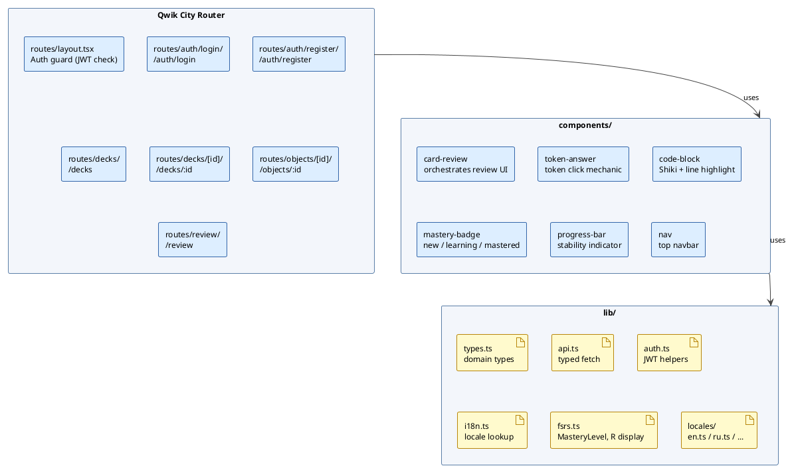

_Рисунок 2.13 — Диаграмма компонентов клиентской части. Файловая маршрутизация Qwik City обеспечивает прямое соответствие между структурой каталогов и URL-пространством приложения. Компонент token-answer реализует ключевой пользовательский механизм; компонент code-block использует библиотеку Shiki для синтаксической подсветки кода с выделением конкретных строк по полю highlight_lines текущей карточки._

---

## 2.10 Выводы по разделу 2

1. Разработана объектная модель системы, включающая семь доменных классов и класс алгоритмического ядра `Scheduler`. Ключевым архитектурным решением является разделение инвариантного описания карточки (класс `Card`) и изменяемого состояния FSRS (класс `CardState`), что обеспечивает независимые траектории обучения для разных пользователей при совместном использовании контента.

2. Спроектирована реляционная схема базы данных с шестью основными таблицами. Использование типа JSONB для хранения массивов токенов и данных попыток устраняет необходимость дополнительных таблиц при сохранении возможности индексирования. Совокупность составных индексов обеспечивает выполнение ключевого запроса выборки карточек для сессии за O(log N + m) при любом размере базы данных.

3. Введена модель **гетерогенного информационного объекта**, формализующая учебный объект как инфо-граф $G = (V, E)$, вершины которого соответствуют отдельным аспектам знания (карточкам), а рёбра — зависимостям «должно быть усвоено прежде». Шаговая структура карточек реализует топологическую сортировку графа и обеспечивает оптимальный порядок предъявления материала в соответствии с теорией когнитивной нагрузки.

4. Разработан и формально описан алгоритм планировщика повторений на основе FSRS с двумя модификациями: автоматическим выводом рейтинга из метаданных взаимодействия с токен-ориентированным интерфейсом и введением эффективной сложности $D_{eff}$, корректируемой коэффициентом иерархической поддержки, вычисляемым по степени усвоения предшествующих карточек инфо-объекта. Собственно вычислительная часть алгоритма работает за O(1), а вычисление коэффициента иерархической поддержки — за O(k), где k равно числу предшествующих карточек текущего шага.

5. Архитектура серверной части оформлена как модульный монолит с явными границами между модулями, взаимодействующими исключительно через Go-интерфейсы; машина состояний карточки с пятью состояниями обеспечивает корректную реализацию обхода рёбер инфо-графа через механизм пошагового разблокирования. Данные решения обеспечивают независимое тестирование компонентов и открывают путь к переходу к микросервисной архитектуре без существенного рефакторинга в последующих итерациях разработки.

---

## Список использованных источников

[22] Донован, Алан А. А., Керниган, Брайан, У. Язык программирования Go. : Пер. с англ. — М. : ООО “И.Д. Вильямс”,. 2016. — 432 с.

[23] OMG Unified Modeling Language Specification. Version 2.5.1 [Электронный ресурс]. — Object Management Group, 2017. — Режим доступа: https://www.omg.org/spec/UML/2.5.1. — (дата обращения: 15.03.2026).

[24] Мартин Р. С. Чистая архитектура. Искусство разработки программного обеспечения. — СПб.: Питер, 2018. ISBN 978-5-4461-0772-8. — 432 с.

[25] Momjian B. PostgreSQL: Introduction and Concepts. — New York : Addison-Wesley, 2001. — 462 с.

[26] Newman S. Building Microservices: Designing Fine-Grained Systems. 2nd ed. — Sebastopol : O'Reilly Media, 2021. — 612 с.

[27] Hevery M. Qwik: Re-imagining Lazy Loading for the Edge [Электронный ресурс] // ViteConf 2022. — Режим доступа: https://qwik.dev/docs/concepts/resumable/. — (дата обращения: 15.03.2026).

[28] Larman C. Applying UML and Patterns: An Introduction to Object-Oriented Analysis and Design and Iterative Development. 3rd ed. — Upper Saddle River : Prentice Hall, 2004. — 736 с.

[29] Буч Г., Рамбо Д., Джекобсон А. Язык UML. Руководство пользователя. 2-е изд. / пер. с англ. — М. : ДМК Пресс, 2006. — 496 с.

[30] Фаулер М. Рефакторинг: улучшение существующего кода / пер. с англ. — СПб. : Символ-Плюс, 2018. — 448 с.

[31] Ye J. A stochastic shortest path algorithm for optimizing spaced repetition scheduling // Proceedings of the 28th ACM SIGKDD Conference on Knowledge Discovery and Data Mining. — 2022. — P. 4381–4390.

[32] Wozniak P. A., Gorzelanczyk E. J. Optimization of repetition spacing in the practice of learning // Acta Neurobiologiae Experimentalis. — 1994. — Vol. 54, № 1. — P. 59–62.

[33] ГОСТ 19.701-90. Единая система программной документации. Схемы алгоритмов, программ, данных и систем. Условные обозначения и правила выполнения. — М. : Изд-во стандартов, 1990. — 26 с.
