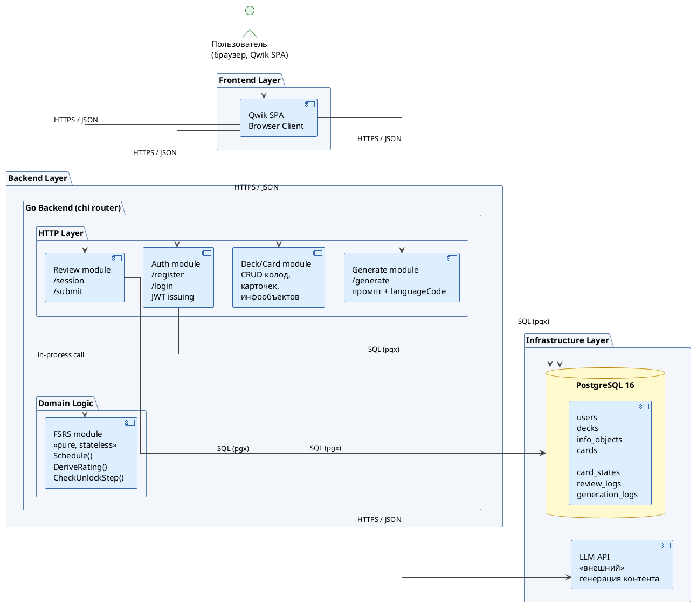
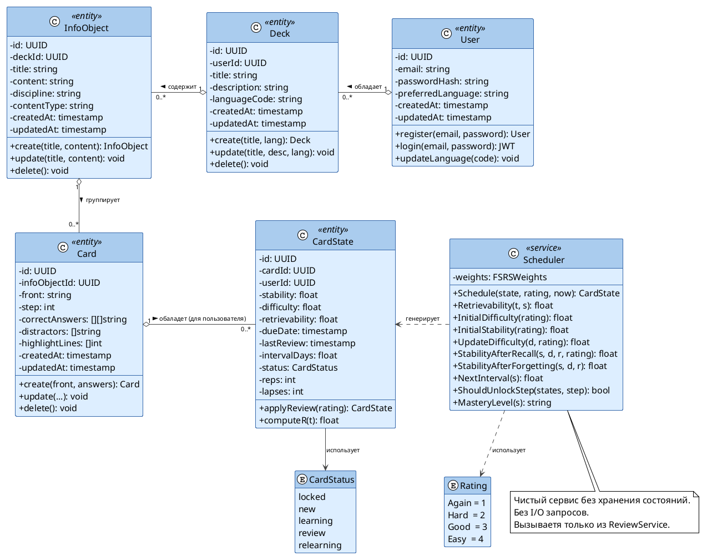
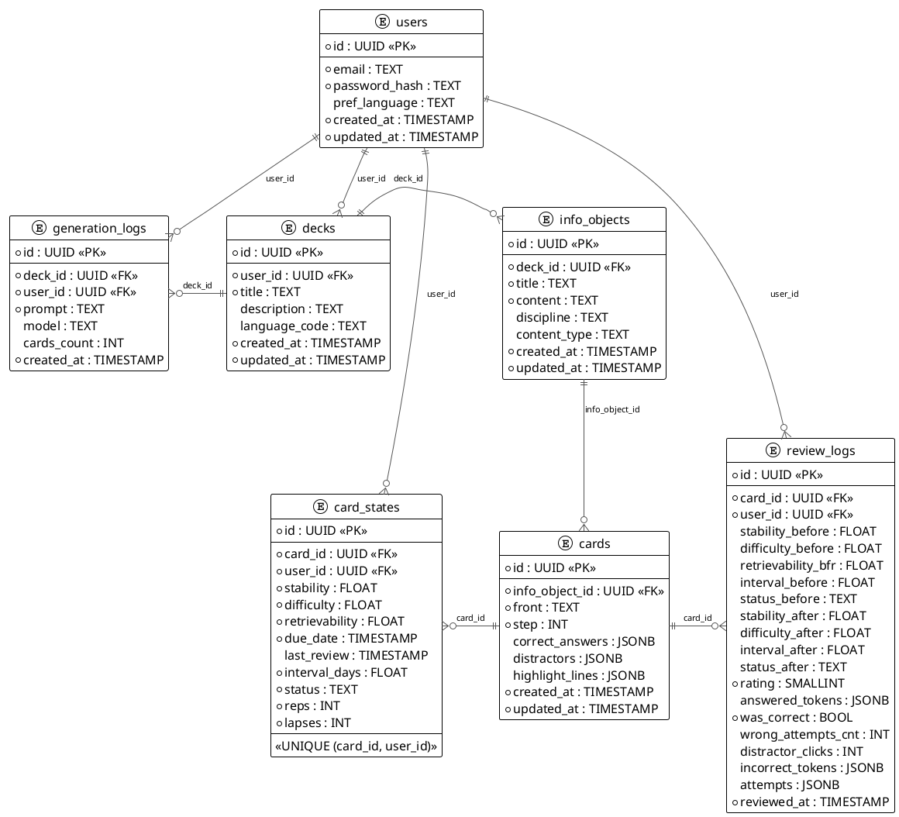
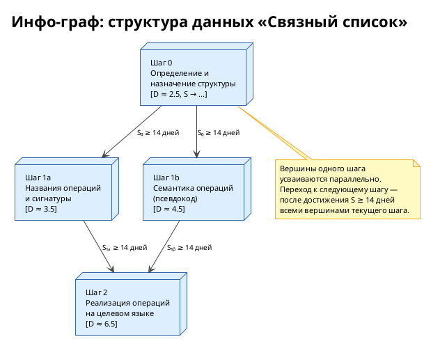

# Раздел 2. Моделирование системы

## 2.1 Методология проектирования и выбор подхода к моделированию

Проектирование обучающей платформы для разработчиков потребовало выбора подхода, адекватного характеру решаемых задач. С учётом того, что система представляет собой веб-приложение с явно выраженными доменными сущностями (пользователь, набор карточек, информационный объект, карточка, состояние карточки), центральной задачей второго этапа проектирования является формализация предметной области и архитектуры системы в виде объектных, структурных и поведенческих моделей.

В качестве основного подхода к проектированию выбрана объектно-ориентированная декомпозиция, которая в наибольшей степени соответствует применяемым в проекте языкам программирования Go и TypeScript [22]. Все структурные и поведенческие модели разработаны в нотации UML 2.5 [23]; схемы алгоритмов представлены в виде блок-схем в соответствии с ГОСТ 19.701-90 [33].

Жизненный цикл разработки строится по итеративной инкрементальной модели, что определяет характер представляемых здесь моделей: они охватывают версию системы в объёме первого итерационного цикла, полностью реализующего функциональное ядро платформы.

Раздел содержит следующие виды моделей:

- объектная модель системы (диаграмма классов UML);
- схема базы данных (ER-модель);
- диаграмма модулей серверной части (диаграмма компонентов UML);
- диаграммы последовательности взаимодействия пользователя с системой;
- диаграмма состояний карточки;
- алгоритмы планировщика повторений (блок-схемы).

---

## 2.2 Требования к системе

### 2.2.1 Функциональные требования

На основании анализа предметной области, проведённого в разделе 1, и данных технического задания сформулированы следующие функциональные требования к системе.

**FR-01. Управление пользователями.** Система должна обеспечивать регистрацию, аутентификацию и хранение профиля пользователя. Профиль включает адрес электронной почты, хеш пароля и предпочтительный язык интерфейса.

**FR-02. Управление наборами карточек (колодами).** Аутентифицированный пользователь должен иметь возможность создавать, просматривать, редактировать и удалять колоды. Каждая колода имеет заголовок, описание и языковой код учебного контента.

**FR-03. Управление информационными объектами.** Пользователь должен иметь возможность создавать информационные объекты — структурные единицы колоды, каждая из которых содержит справочный текст или фрагмент кода, выступающий контекстом для связанного набора карточек.

**FR-04. Управление карточками.** В рамках информационного объекта пользователь должен иметь возможность создавать, редактировать и удалять карточки. Карточка содержит вопрос, набор правильных последовательностей токенов-ответов, набор токенов-дистракторов, номер шага разблокировки и список номеров строк для подсветки в справочном контенте.

**FR-05. Токен-ориентированный механизм ответа.** При просмотре карточки пользователю предъявляется перемешанный набор токенов (правильные токены и дистракторы). Пользователь выбирает токены в нужном порядке; правильность и метаданные попытки фиксируются на клиентской стороне и передаются на сервер вместе с ответом.

**FR-06. Сессия повторений.** Система должна формировать для пользователя список карточек, подлежащих повторению в текущей сессии: просроченные карточки в статусах learning/review/relearning и новые разблокированные карточки.

**FR-07. Планирование повторений по алгоритму FSRS.** После каждого ответа система должна автоматически вычислять рейтинг ответа и обновлять параметры FSRS (D, S, R) и дату следующего повторения.

**FR-08. Механизм пошагового разблокирования.** Карточки информационного объекта разделены на шаги (step 0, 1, 2, …). Карточки шага N разблокируются только после достижения всеми карточками шага N−1 порога стабильности S ≥ 14 дней.

**FR-09. Автоматическая генерация контента.** Система должна предоставлять конечную точку, принимающую тему или фрагмент текста и возвращающую сгенерированный набор информационных объектов с карточками, созданных с использованием большой языковой модели.

**FR-10. Статистика прогресса.** Система должна предоставлять агрегированную статистику по колоде (распределение карточек по уровням освоения) и историю повторений конкретной карточки.

**FR-11. Многоязычный интерфейс.** Пользовательский интерфейс должен поддерживать смену языка. Все строки интерфейса загружаются из словарей локализации; язык интерфейса определяется полем `preferredLanguage` профиля пользователя.

### 2.2.2 Нефункциональные требования

**NFR-01. Производительность.** Запрос сессии повторений и отправка ответа должны выполняться за не более чем 300 мс при нагрузке до 100 одновременных пользователей.

**NFR-02. Безопасность.** Аутентификация реализуется посредством JWT с временем жизни 7 дней; пароли хранятся в виде bcrypt-хешей с коэффициентом стоимости 12.

**NFR-03. Расширяемость.** Серверная часть структурирована в виде модульного монолита, допускающего выделение отдельных модулей в микросервисы без существенного рефакторинга.

**NFR-04. Кроссплатформенность.** Клиентская часть должна корректно работать во всех современных браузерах и адаптироваться к мобильным экранам.

**NFR-05. Интернационализация.** Языковой код контента хранится на уровне колоды и наследуется всеми вложенными сущностями. Генерация контента через LLM должна использовать языковой код колоды.

---

## 2.3 Объектная модель системы

### 2.3.0 Верхнеуровневая схема работы приложения

Перед детальным описанием классов приводится верхнеуровневая схема, отражающая взаимодействие основных слоёв системы и ключевые потоки данных между ними.



_Рисунок 2.0 — Верхнеуровневая схема работы приложения. Клиентская SPA взаимодействует с бэкендом исключительно через REST API. Модуль FSRS является stateless-ядром без I/O, вызываемым только из Review module. Генерация контента делегируется внешнему LLM API с фиксацией всех обращений в БД._

### 2.3.1 Диаграмма классов

Объектная модель системы включает следующие основные классы предметной области: `User`, `Deck`, `InfoObject`, `Card`, `CardState`, `ReviewLog`, `GenerationLog`. Помимо доменных классов, в систему входят служебные классы алгоритмического ядра: `Scheduler` и `FSRSWeights`, а также вспомогательные перечислимые типы `Rating` и `CardStatus`.



_Рисунок 2.1 — Диаграмма классов предметной области. Агрегации (o--) отражают иерархию владения: User → Deck → InfoObject → Card → CardState. Класс Scheduler является чистым сервисом без состояния и I/O._

### 2.3.2 Пояснение к объектной модели

Иерархия `User → Deck → InfoObject → Card → CardState` отражает логику владения данными в системе. Пользователь владеет набором колод; каждая колода содержит информационные объекты; каждый информационный объект группирует карточки по тематическому принципу. Ключевым архитектурным решением является разделение инвариантного описания карточки (класс `Card`) и изменяемого состояния FSRS (класс `CardState`): одна и та же карточка может находиться в разных состояниях у разных пользователей, что обеспечивает корректную работу в многопользовательском режиме без дублирования контента.

С точки зрения разрабатываемого алгоритма класс `InfoObject` выполняет роль корневой вершины **инфо-графа** — ориентированного графа, вершины которого соответствуют отдельным аспектам знания об изучаемом объекте, а рёбра — отношениям «необходимо знать прежде, чем». Класс `Card` представляет отдельную вершину этого графа, то есть конкретную грань сложного понятия. Номер шага (`step`) задаёт уровень графа: вершины одного уровня могут усваиваться параллельно, тогда как переход к следующему уровню возможен лишь после достаточного закрепления всех вершин текущего уровня. Именно такая декомпозиция позволяет формализовать гетерогенность учебного объекта: разные карточки одного `InfoObject` могут проверять принципиально различные типы знания — определение, применение, реализацию в коде — и обладать различным уровнем сложности `D`, характеризующим трудность именно данной грани.

Класс `Scheduler` намеренно не содержит состояния и не обращается к базе данных. Это обеспечивает детерминированность алгоритма: при одинаковых входных данных (параметры состояния карточки, рейтинг ответа, метка времени) всегда возвращается идентичный результат. Такая архитектура позволяет проводить полное юнит-тестирование алгоритма без развёртывания тестовой инфраструктуры [24].

---

## 2.4 Схема базы данных

База данных реализована на СУБД PostgreSQL 16. Все идентификаторы используют тип UUID, генерируемый встроенной функцией `gen_random_uuid()`. Миграции управляются инструментом `golang-migrate/migrate`. Схема включает шесть основных таблиц: `users`, `decks`, `info_objects`, `cards`, `card_states`, `review_logs`, а также вспомогательную таблицу `generation_logs`.



_Рисунок 2.3 — ER-диаграмма схемы базы данных. `*` — обязательное поле. PK — первичный ключ, FK — внешний ключ. Таблица `card_states` связана как с `cards`, так и с `users`, реализуя пару (карточка, пользователь) с уникальным ограничением UNIQUE (card_id, user_id). Таблица `review_logs` — неизменяемый журнал всех событий повторения. Таблица `generation_logs` фиксирует все обращения к LLM._

### 2.4.1 Пояснение к схеме данных

Центральным решением в схеме базы данных является отделение таблицы `card_states` от таблицы `cards`. Таблица `cards` хранит неизменяемое описание карточки — вопрос, правильные ответы, дистракторы, номер шага. Таблица `card_states` хранит индивидуальное состояние алгоритма FSRS для конкретной пары (карточка, пользователь). Данная структура обеспечивает несколько важных свойств: один и тот же контент может использоваться несколькими пользователями с независимыми траекториями обучения; история повторений в `review_logs` позволяет в будущем реализовать дообучение весовых коэффициентов FSRS под конкретного пользователя; генерация контента фиксируется в `generation_logs` с полным текстом промпта, что обеспечивает возможность аудита.

Поля типа JSONB (`correct_answers`, `distractors`, `highlight_lines`, `answered_tokens`, `attempts`) выбраны для хранения структурированных массивов переменной длины, что устраняет необходимость введения дополнительных связующих таблиц и сохраняет возможность выполнения запросов к их содержимому средствами PostgreSQL [25].

Индексы, критичные для производительности сессии повторений:

- `idx_card_states_due` — составной индекс по `(user_id, due_date)` с частичным предикатом `status IN ('learning', 'review', 'relearning')` — обеспечивает быстрый выбор просроченных карточек;
- `idx_card_states_user_status` — по `(user_id, status)` — обеспечивает выбор новых карточек;
- `idx_cards_step` — по `(info_object_id, step)` — обеспечивает быструю проверку условий разблокировки шага.

---

## 2.5 Диаграмма модулей серверной части

Серверная часть реализована как модульный монолит на языке Go. Модульный монолит — это архитектурный стиль, при котором приложение развёртывается как единый процесс, однако внутренние границы между модулями проведены достаточно явно, чтобы при необходимости выделить отдельные модули в самостоятельные сервисы без существенного рефакторинга [26]. Взаимодействие между модулями осуществляется исключительно через Go-интерфейсы, что предотвращает нежелательные связи между реализациями.

```
┌──────────────────────────────────────────────────────────────────┐
│                         HTTP Layer                               │
│                  chi Router (go-chi/chi v5)                      │
│   ┌──────────────┐  ┌──────────────┐  ┌────────────────────┐   │
│   │   Recovery   │  │    Logger    │  │  Auth (JWT verify) │   │
│   │  middleware  │  │  middleware  │  │     middleware     │   │
│   └──────────────┘  └──────────────┘  └────────────────────┘   │
└──────────────────────────────┬───────────────────────────────────┘
                               │
          ┌────────────────────┼────────────────────┐
          │                    │                    │
┌─────────▼──────┐  ┌──────────▼──────┐  ┌─────────▼──────────┐
│  user module   │  │  deck module    │  │   card module      │
│ ─────────────  │  │ ─────────────   │  │ ─────────────────  │
│ model.go       │  │ model.go        │  │ model.go           │
│ repository.go  │  │ repository.go   │  │ repository.go      │
│ service.go     │  │ service.go      │  │ service.go         │
│ handler.go     │  │ handler.go      │  │ handler.go         │
│                │  │                 │  │                    │
│ owns: users    │  │ owns: decks     │  │ owns: cards,       │
└────────────────┘  └─────────────────┘  │       info_objects │
                                         └────────────────────┘
          ┌────────────────────┬────────────────────┐
          │                    │                    │
┌─────────▼──────┐  ┌──────────▼──────┐  ┌─────────▼──────────┐
│ review module  │  │  fsrs module    │  │  generate module   │
│ ─────────────  │  │ ─────────────   │  │ ─────────────────  │
│ model.go       │  │ fsrs.go         │  │ model.go           │
│ repository.go  │  │ scheduler.go    │  │ service.go         │
│ service.go     │  │ fsrs_test.go    │  │ handler.go         │
│ handler.go     │  │                 │  │                    │
│                │  │ pure logic,     │  │ owns:              │
│ owns: states,  │  │ no I/O          │  │ generation_logs    │
│       logs     │  └─────────────────┘  └────────────────────┘
└────────────────┘
          │
          │ calls via interfaces
          ▼
┌──────────────────────────────────────────────────────────────────┐
│                      platform module                             │
│  ┌────────────┐  ┌──────────────┐  ┌───────────┐  ┌──────────┐ │
│  │  db/       │  │  middleware/ │  │ response/ │  │ config/  │ │
│  │ postgres.go│  │  auth.go     │  │  json.go  │  │config.go │ │
│  │            │  │  logger.go   │  │           │  │          │ │
│  │            │  │  recovery.go │  │           │  │          │ │
│  └────────────┘  └──────────────┘  └───────────┘  └──────────┘ │
└──────────────────────────────────────────────────────────────────┘
          │                                    │
          ▼                                    ▼
┌─────────────────────┐             ┌──────────────────────┐
│  PostgreSQL 16+     │             │  Anthropic Claude API │
│  (pgx/v5 driver)   │             │  (HTTP client)        │
└─────────────────────┘             └──────────────────────┘
```

_Рисунок 2.5 — Диаграмма компонентов серверной части (UML Component Diagram). Каждый доменный модуль имеет одинаковую внутреннюю структуру из четырёх файлов: model, repository, service, handler. Модуль fsrs не имеет зависимостей на уровне I/O и вызывается только из review.ReviewService._

### 2.5.1 Пояснение к модульной структуре

Каждый доменный модуль (`user`, `deck`, `card`, `review`, `generate`) организован по единой схеме из четырёх файлов: `model.go` содержит доменные структуры; `repository.go` — интерфейс репозитория и его реализацию через `pgx`; `service.go` — бизнес-логику, оперирующую репозиторием через интерфейс; `handler.go` — HTTP-обработчики, вызывающие методы сервиса.

Такая структура обеспечивает несколько архитектурных свойств. Во-первых, тестируемость: сервис может быть протестирован с мок-репозиторием без подключения к базе данных. Во-вторых, заменяемость инфраструктуры: реализацию `pgx`-репозитория можно заменить, например, in-memory-реализацией для тестов, не изменяя ни одной строки бизнес-логики. В-третьих, явные границы модулей: модуль `review` не импортирует конкретные типы из модуля `card` напрямую; вместо этого он объявляет интерфейс `CardStateReader`, который реализует `card.CardRepository` [24].

Модуль `generate` взаимодействует с внешним API Anthropic через HTTP-клиент. Промпт конструируется с учётом языкового кода целевой колоды (`deck.languageCode`), что гарантирует генерацию вопросов, ответов и дистракторов на нужном языке. Все обращения к LLM фиксируются в таблице `generation_logs` с полным текстом промпта, использованной моделью и числом созданных карточек.

---

## 2.6 Диаграммы последовательности взаимодействия пользователя с системой

### 2.6.1 Сценарий регистрации и аутентификации

```
Пользователь    Браузер          Backend API       PostgreSQL
     │              │                 │                 │
     │  заполняет   │                 │                 │
     │  форму       │                 │                 │
     │─────────────>│                 │                 │
     │              │ POST /api/v1/   │                 │
     │              │ auth/register   │                 │
     │              │{email, pass,    │                 │
     │              │ preferredLang}  │                 │
     │              │────────────────>│                 │
     │              │                 │ bcrypt(pass,12) │
     │              │                 │ INSERT users    │
     │              │                 │────────────────>│
     │              │                 │<────────────────│
     │              │                 │ генерация JWT   │
     │              │                 │ (sub=userID,    │
     │              │                 │  exp=7 дней)    │
     │              │ {token, user}   │                 │
     │              │<────────────────│                 │
     │              │ localStorage    │                 │
     │              │ .setItem("jwt") │                 │
     │              │ redirect /decks │                 │
     │<─────────────│                 │                 │
```

_Рисунок 2.6 — Диаграмма последовательности: регистрация пользователя. Пароль хешируется на стороне сервера алгоритмом bcrypt с коэффициентом стоимости 12; JWT хранится в localStorage браузера._

### 2.6.2 Сценарий сессии повторений

Сессия повторений является ключевым пользовательским сценарием в системе. Диаграмма охватывает полный цикл: от загрузки карточек до отправки ответа и обновления состояния FSRS с последующей проверкой условий разблокировки следующего шага.

```
Пользователь    Браузер        Backend API     PostgreSQL    Scheduler
     │              │               │               │              │
     │ /review      │               │               │              │
     │─────────────>│               │               │              │
     │              │ GET /api/v1/  │               │              │
     │              │ review/session│               │              │
     │              │──────────────>│               │              │
     │              │               │ SELECT        │              │
     │              │               │ due + new     │              │
     │              │               │ cards (LIMIT) │              │
     │              │               │──────────────>│              │
     │              │               │<──────────────│              │
     │              │ ReviewCard[]  │               │              │
     │              │<──────────────│               │              │
     │              │ отображает    │               │              │
     │              │ первую карточку               │              │
     │<─────────────│               │               │              │
     │              │               │               │              │
     │ выбирает     │               │               │              │
     │ токены       │               │               │              │
     │─────────────>│               │               │              │
     │              │ проверка      │               │              │
     │              │ на клиенте    │               │              │
     │              │               │               │              │
     │ последнее    │               │               │              │
     │ подтверждение│               │               │              │
     │─────────────>│               │               │              │
     │              │ POST /api/v1/ │               │              │
     │              │ review/submit │               │              │
     │              │ {cardId,      │               │              │
     │              │  answered-    │               │              │
     │              │  Tokens,      │               │              │
     │              │  attempts,    │               │              │
     │              │  metadata}    │               │              │
     │              │──────────────>│               │              │
     │              │               │ GET           │              │
     │              │               │ card_state    │              │
     │              │               │──────────────>│              │
     │              │               │<──────────────│              │
     │              │               │ DeriveRating  │              │
     │              │               │ (metadata) ──────────────────>│
     │              │               │ Schedule(     │              │
     │              │               │ state, rating)│              │
     │              │               │<──────────────────────────────│
     │              │               │ UPDATE        │              │
     │              │               │ card_states   │              │
     │              │               │──────────────>│              │
     │              │               │ INSERT        │              │
     │              │               │ review_logs   │              │
     │              │               │──────────────>│              │
     │              │               │ CheckStep-    │              │
     │              │               │ Unlock        │              │
     │              │               │──────────────>│              │
     │              │               │<──────────────│              │
     │              │               │ (при выполне- │              │
     │              │               │ нии условия)  │              │
     │              │               │ UPDATE locked │              │
     │              │               │ → new         │              │
     │              │               │──────────────>│              │
     │              │ ReviewResult  │               │              │
     │              │<──────────────│               │              │
     │ следующая    │               │               │              │
     │ карточка     │               │               │              │
     │<─────────────│               │               │              │
```

_Рисунок 2.7 — Диаграмма последовательности: сессия повторений. Рейтинг ответа (Again/Hard/Good/Easy) выводится автоматически из метаданных взаимодействия; явного выбора пользователем не требуется. После каждого обновления card_states проверяются условия разблокировки следующего шага._

### 2.6.3 Сценарий автоматической генерации учебного контента

```
Пользователь    Браузер        Backend API     Anthropic LLM   PostgreSQL
     │              │               │               │               │
     │ вводит тему  │               │               │               │
     │ или текст    │               │               │               │
     │─────────────>│               │               │               │
     │              │ POST /api/v1/ │               │               │
     │              │ generate      │               │               │
     │              │ {deckId,      │               │               │
     │              │  topic,       │               │               │
     │              │  lang}        │               │               │
     │              │──────────────>│               │               │
     │              │               │ GET deck      │               │
     │              │               │ languageCode  │               │
     │              │               │──────────────────────────────>│
     │              │               │<──────────────────────────────│
     │              │               │ строит промпт │               │
     │              │               │ с lang + topic│               │
     │              │               │──────────────>│               │
     │              │               │ генерирует    │               │
     │              │               │ InfoObjects + │               │
     │              │               │ Cards (JSON)  │               │
     │              │               │<──────────────│               │
     │              │               │ валидация,    │               │
     │              │               │ парсинг JSON  │               │
     │              │               │ INSERT        │               │
     │              │               │ info_objects  │               │
     │              │               │──────────────────────────────>│
     │              │               │ INSERT cards  │               │
     │              │               │──────────────────────────────>│
     │              │               │ INSERT        │               │
     │              │               │ generation_log│               │
     │              │               │──────────────────────────────>│
     │              │ {objects,     │               │               │
     │              │  cards_count} │               │               │
     │              │<──────────────│               │               │
     │ результат    │               │               │               │
     │<─────────────│               │               │               │
```

_Рисунок 2.8 — Диаграмма последовательности: автоматическая генерация учебного контента. Промпт явно включает языковой код колоды, что обеспечивает соответствие сгенерированного контента целевому языку обучения. Все запросы к LLM фиксируются в generation_logs._

---

## 2.7 Диаграмма состояний карточки

Каждая карточка в системе в разрезе конкретного пользователя находится в одном из пяти состояний: `locked`, `new`, `learning`, `review`, `relearning`. Переходы между состояниями определяются результатами повторений и механизмом пошагового разблокирования.

```
                    ┌────────────────────────────────────┐
                    │  Карточка создана в InfoObject     │
                    └─────────────────┬──────────────────┘
                                      │
              ┌───────────────────────┴──────────────────────┐
           step > 0                                        step = 0
              │                                               │
┌─────────────▼────────────────┐            ┌────────────────▼──────────────┐
│           LOCKED             │            │              NEW              │
│  Шаг N > 0; все карточки     │            │  Доступна для первого          │
│  шага N-1 ещё не достигли    │            │  повторения                    │
│  S ≥ 14 дней                 │            └────────────────┬──────────────┘
└─────────────┬────────────────┘                             │
              │ [все карточки шага N-1                       │ первое повторение
              │  достигли S ≥ 14 дней]                       │
              └───────────────────────────────────────────────┘
                                      │
                    ┌─────────────────▼──────────────────┐
                    │            LEARNING                │
                    │  S < 21 дня                        │
                    │  Карточка в процессе заучивания    │
                    └───────────┬──────────┬─────────────┘
                                │          │
              [rating ≠ Again   │          │  [rating = Again]
               И S ≥ 21 дней]  │          │
                    ┌───────────▼────────┐ │
                    │       REVIEW       │ │
                    │  S ≥ 21 дней       │ │
                    │  Устойчивое        │ │ (возврат)
                    │  долгосрочное      │ │
                    │  запоминание       │ │
                    └───────────┬────────┘ │
                                │          │
                   [rating =    │          │
                    Again;      │          │
                    lapses++]   │          │
                    ┌───────────▼────────┐ │
                    │     RELEARNING     │ │
                    │  Ошибка после      ├─┘
                    │  REVIEW —          │  [rating ≠ Again]
                    │  переучивание      │  → LEARNING
                    └────────────────────┘
```

_Рисунок 2.9 — Диаграмма состояний карточки (UML State Machine Diagram). Переход из LOCKED в NEW инициируется системой автоматически после достижения всеми карточками предыдущего шага порога стабильности S ≥ 14 дней. Граница между LEARNING и REVIEW установлена на значении S = 21 день._

### 2.7.1 Пояснение к диаграмме состояний

Введение порога перехода в статус `review` на уровне S = 21 дня означает, что карточка считается долгосрочно усвоенной лишь при достижении трёхнедельного горизонта запоминания. На практике это соответствует 3–4 успешным повторениям для материала среднего уровня сложности при использовании предобученных весовых коэффициентов FSRS.

Статус `relearning` отличается от `learning` тем, что переход в него из `review` сопровождается инкрементом счётчика `lapses`. Данный счётчик отражает число «срывов» памяти после достижения долгосрочного запоминания и используется в статистических отчётах для выявления материала с аномально высокой скоростью забывания. В будущих итерациях разработки данные `lapses` могут быть задействованы для коррекции весовых коэффициентов в персонализированном режиме оптимизации FSRS [31].

Механизм пошагового разблокирования (`locked → new`) реализует на уровне машины состояний обход рёбер инфо-графа (см. подраздел 2.8.0): переход ребра $e_{ij}$ из «заблокированного» в «активное» состояние происходит в тот момент, когда все вершины-предшественники $v_i$ достигают порогового значения стабильности $S \geq 14$ дней. Это соответствует обоснованной в разделе 1 идее о том, что освоение сложных граней учебного объекта должно начинаться только после достаточного закрепления базовых: физическое ограничение доступа к карточкам следующего шага исключает преждевременную когнитивную нагрузку, обусловленную обращением к незакреплённым предварительным знаниям [13].

---

## 2.8 Алгоритмы планировщика повторений

В данном подразделе приводится полное описание алгоритмов планировщика повторений, реализованного в системе. Алгоритм представляет собой адаптацию FSRS (Free Spaced Repetition Scheduler) с двумя собственными модификациями: во-первых, автоматическим выводом рейтинга из метаданных взаимодействия вместо явной самооценки пользователя; во-вторых, введением модели **гетерогенного информационного объекта**, углубляющей связь между сложностью D и структурой изучаемой сущности [31, 32].

### 2.8.0 Модель гетерогенного информационного объекта

Алгоритмы SM и FSRS эволюционировали в направлении всё более полного учёта свойств информационного объекта: если алгоритм SM-2 оперировал единственным параметром EF, то FSRS уже явно вычисляет сложность D и обновляет её после каждого повторения. Тем не менее в обоих случаях объект изучения трактуется как **гомогенная** единица информации, полностью описываемая парой «вопрос — ответ», то есть ориентированным графом с двумя вершинами.

Практика показывает, что значительная часть учебного материала — особенно в области программирования — представляет собой **гетерогенные** информационные объекты, полное освоение которых требует запоминания нескольких принципиально различных граней. Приведём два характерных примера.

**Пример 1. Структура данных «связный список»** (дисциплина «Алгоритмы и структуры данных»). Чтобы считать данную структуру данных усвоенной, обучающемуся необходимо:

- знать определение структуры и область её применения;
- знать названия операций и их сигнатуры;
- понимать семантику каждой операции (хотя бы на уровне псевдокода);
- уметь реализовать каждую операцию на изучаемом языке программирования.

Ни одно из перечисленных знаний в отдельности не является достаточным для признания объекта усвоенным.

**Пример 2. Китайское слово 沙漠 (пустыня)** (дисциплина «Китайский язык»). Полное освоение данной лексической единицы требует:

- знания перевода (沙漠 → пустыня);
- знания пиньиня и произношения (shā mò);
- знания состава и значения отдельных иероглифов (沙 — песок, 漠 — пустошь);
- умения прочитать слово при его предъявлении в тексте;
- умения воспроизвести написание каждого иероглифа.

В языках с фонетическим письмом (французский, турецкий) задача сводится к запоминанию гомогенной пары «иностранное слово — перевод», то есть инфо-граф вырождается в две вершины. Для языков с идеографическим письмом граф существенно сложнее.

Оба приведённых примера демонстрируют ключевое свойство гетерогенного информационного объекта: **его усвоение определяется качеством усвоения всех составляющих его граней**. Нельзя утверждать, что обучающийся знает связный список, если он умеет лишь воспроизвести определение, но не способен реализовать операцию вставки. Аналогично нельзя утверждать, что обучающийся знает слово «пустыня» на китайском, если он знает его звучание, но не может записать иероглифы.

Формально такой объект моделируется как **инфо-граф** $G = (V, E)$, где вершины $v_i \in V$ соответствуют отдельным аспектам знания (каждой вершине соответствует карточка системы), а ориентированные рёбра $e_{ij} \in E$ кодируют зависимость «вершина $v_i$ должна быть усвоена на достаточном уровне, прежде чем начнётся усвоение вершины $v_j$». Понятие «достаточного уровня» формализуется через порог стабильности: вершина $v_i$ считается освоенной для целей разблокировки, если $S_i \geq S_{\min}$ (в реализованной системе $S_{\min} = 14$ дней).

Шаговая структура карточек (`step`) реализует топологическую сортировку инфо-графа: вершины одного шага не имеют рёбер между собой (могут усваиваться параллельно), а все рёбра направлены от вершин шага $n-1$ к вершинам шага $n$. Данное упрощение допустимо для большинства практических случаев и существенно упрощает реализацию механизма разблокировки. Для более сложных топологий граф может быть аппроксимирован цепочкой слоёв с разбиением вершин по уровням обобщённой BFS-обходки.

Параметр сложности $D$, вычисляемый алгоритмом FSRS, в контексте данной модели приобретает новый смысл: он характеризует трудность **конкретной грани** объекта — отдельной вершины инфо-графа. Разные вершины одного и того же объекта закономерно обладают различными значениями $D$: например, для связного списка запомнить определение (шаг 0) значительно проще, чем реализовать удаление узла в коде (шаг 2). Это соответствует эмпирически наблюдаемой неоднородности сложности внутри одной предметной области.

Таким образом, разрабатываемый алгоритм является развитием FSRS в направлении **более глубокой связи между параметрами алгоритма и структурой информационного объекта**: если FSRS учитывает сложность объекта как скалярную величину, новый алгоритм рассматривает сложность как вектор, компоненты которого соответствуют отдельным вершинам инфо-графа, а условия перехода между вершинами определяются структурой рёбер этого графа.



_Рисунок 2.14 — Инфо-граф информационного объекта «Связный список». Вершины соответствуют карточкам системы; рёбра — зависимостям «должно быть усвоено прежде». Значения D отражают различие в сложности граней одного объекта. Вершины шагов 1a и 1b могут усваиваться параллельно; переход к шагу 2 возможен лишь после достижения порога стабильности обеими вершинами шага 1._

### 2.8.1 Алгоритм вывода рейтинга из метаданных ответа

В отличие от эталонной реализации FSRS, в которой пользователь явно выбирает оценку (Again/Hard/Good/Easy) после каждого повторения, в данной системе рейтинг выводится автоматически из метаданных взаимодействия пользователя с карточкой. Это исключает субъективность самооценки и обеспечивает воспроизводимость результатов.

```
┌──────────────────────────────────────────────────────────┐
│                 НАЧАЛО: DeriveRating                     │
│  Входные данные:                                         │
│    wasCorrect           : bool                           │
│    wrongAttemptsCount   : int                            │
│    distractorClicksCount: int                            │
└─────────────────────────────┬────────────────────────────┘
                              │
                    ┌─────────▼─────────┐
                    │  wasCorrect       │
                    │  == false?        │
                    └────┬────────┬─────┘
                        ДА       НЕТ
                         │        │
              ┌──────────▼──┐  ┌──▼──────────────────────────┐
              │ Return      │  │ wrongAttemptsCount > 0?      │
              │ Again (1)   │  └──┬────────────────────┬──────┘
              └─────────────┘    ДА                   НЕТ
                                  │                    │
                     ┌────────────▼──┐   ┌─────────────▼──────────────┐
                     │ Return        │   │ distractorClicksCount > 0? │
                     │ Hard (2)      │   └──────────┬─────────────┬───┘
                     └───────────────┘             ДА            НЕТ
                                                    │             │
                                       ┌────────────▼──┐  ┌───────▼──────┐
                                       │ Return        │  │ Return       │
                                       │ Good (3)      │  │ Easy (4)     │
                                       └───────────────┘  └──────────────┘
```

_Рисунок 2.10 — Блок-схема алгоритма вывода рейтинга FSRS из метаданных ответа. Четыре ветви соответствуют стандартным оценкам FSRS: Again (1) — неправильный финальный ответ; Hard (2) — правильный ответ с предшествующими ошибочными попытками; Good (3) — правильный ответ без ошибочных попыток, но с нажатием дистракторов; Easy (4) — правильный ответ с первой попытки без нажатия дистракторов._

### 2.8.2 Алгоритм полного цикла планирования повторения

Метод `Schedule` является центральным алгоритмом системы. Он принимает текущее состояние карточки, выведенный рейтинг и метку времени; возвращает обновлённое состояние с новыми значениями стабильности S, сложности D, извлекаемости R и датой следующего повторения.

```
┌─────────────────────────────────────────────────────────┐
│                  НАЧАЛО: Schedule                       │
│  Входные данные:                                        │
│    state : CardState                                    │
│    rating: Rating (1..4)                                │
│    now   : time.Time                                    │
└──────────────────────────┬──────────────────────────────┘
                           │
             ┌─────────────▼──────────────┐
             │ Вычислить t (дней с        │
             │ последнего повторения):    │
             │ t = (now − lastReview) / 24│
             └─────────────┬──────────────┘
                           │
             ┌─────────────▼──────────────┐
             │ Вычислить R(t, S):         │
             │ R = (1+Factor×t/S)^Decay   │
             │ Factor = 19/81 ≈ 0.2346    │
             │ Decay  = −0.5              │
             └─────────────┬──────────────┘
                           │
                  ┌────────▼────────┐
                  │ rating == 1     │
                  │ (Again)?        │
                  └──┬───────────┬──┘
                    ДА          НЕТ
                     │           │
        ┌────────────▼─┐  ┌──────▼──────────────────────┐
        │ newS =       │  │ newS =                      │
        │ Stability-   │  │ StabilityAfterRecall        │
        │ After-       │  │ (S, D, R, rating, W)       │
        │ Forgetting   │  │                             │
        │ (S, D, R, W) │  │ newD =                      │
        │              │  │ UpdateDifficulty            │
        │ newD =       │  │ (D, rating, W)              │
        │ UpdateDiff   │  │                             │
        │ (D, Again, W)│  │ reps++                      │
        │              │  │                             │
        │ если status  │  │ if newS >= 21:              │
        │ == review:   │  │   status = review           │
        │ lapses++     │  │ else:                       │
        │              │  │   status = learning         │
        │ status =     │  └──────────────┬──────────────┘
        │ relearning   │                 │
        └──────┬───────┘                 │
               └──────────────┬──────────┘
                              │
             ┌────────────────▼─────────────────┐
             │ intervalDays =                   │
             │   max(NextInterval(newS), 1)      │
             │                                  │
             │ NextInterval(s) =                 │
             │   round(s / Factor ×             │
             │   (DR^(1/Decay) − 1))            │
             │   DR = DesiredRetention = 0.9     │
             │                                  │
             │ dueDate = now + intervalDays × 24h│
             │                                  │
             │ newR = R(0, newS) ≈ 1.0          │
             └────────────────┬─────────────────┘
                              │
             ┌────────────────▼─────────────────┐
             │ Вернуть обновлённый CardState:   │
             │   stability    = newS            │
             │   difficulty   = newD            │
             │   retrievability = newR          │
             │   intervalDays = intervalDays    │
             │   dueDate      = dueDate         │
             │   status       = status          │
             │   reps         = reps            │
             │   lapses       = lapses          │
             └────────────────┬─────────────────┘
                              │
                         ┌────▼────┐
                         │  КОНЕЦ  │
                         └─────────┘
```

_Рисунок 2.11 — Блок-схема основного алгоритма планировщика FSRS (метод Schedule). Разветвление по рейтингу определяет применение одной из двух функций обновления стабильности: StabilityAfterRecall для правильных ответов или StabilityAfterForgetting для ошибочных._

### 2.8.3 Алгоритм пошагового разблокирования карточек

После каждого успешного обновления `card_states` выполняется проверка условий разблокировки следующего шага карточек информационного объекта.

```
┌──────────────────────────────────────────────────────────┐
│         НАЧАЛО: CheckAndUnlockNextStep                   │
│  Входные данные:                                         │
│    userID        : UUID                                  │
│    infoObjectID  : UUID                                  │
│    completedStep : int                                   │
└───────────────────────────┬──────────────────────────────┘
                            │
     ┌──────────────────────▼──────────────────────────┐
     │ SELECT COUNT(*) FROM cards c                    │
     │ JOIN card_states cs ON cs.card_id = c.id        │
     │ WHERE c.info_object_id = infoObjectID           │
     │   AND c.step           = completedStep          │
     │   AND cs.user_id       = userID                 │
     │   AND cs.stability     < 14                     │
     └──────────────────────┬──────────────────────────┘
                            │
                   ┌────────▼──────────┐
                   │  count == 0?      │
                   │  (все карточки    │
                   │   шага достигли   │
                   │   S ≥ 14 дней?)   │
                   └──┬────────────┬───┘
                     ДА           НЕТ
                      │            │
         ┌────────────▼──┐  ┌──────▼──────────┐
         │ UPDATE        │  │ Завершить,      │
         │ card_states   │  │ ничего не делать│
         │ SET status =  │  └─────────────────┘
         │ 'new'         │
         │ WHERE step =  │
         │ completedStep │
         │ + 1 AND       │
         │ status =      │
         │ 'locked'      │
         └───────┬───────┘
                 │
         ┌───────▼───────┐
         │     КОНЕЦ     │
         └───────────────┘
```

_Рисунок 2.12 — Блок-схема алгоритма пошагового разблокирования. Операции SELECT и UPDATE выполняются в рамках одной транзакции вместе с обновлением card_states по итогам повторения, что гарантирует целостность данных._

### 2.8.4 Оценка алгоритмической сложности

Функции алгоритмического ядра FSRS (`Retrievability`, `InitialDifficulty`, `InitialStability`, `UpdateDifficulty`, `StabilityAfterRecall`, `StabilityAfterForgetting`, `NextInterval`) работают за **O(1)** по времени и O(1) по памяти: все операции — арифметические вычисления над фиксированным числом переменных.

Метод `Schedule` также работает за **O(1)**: он вызывает указанные функции фиксированное число раз вне зависимости от входных данных.

Алгоритм `DeriveRating` выполняет три сравнения над булевыми и целочисленными значениями и работает за **O(1)**.

Алгоритм `CheckAndUnlockNextStep` выполняет один SELECT-запрос с фильтрацией по индексу `idx_cards_step` и один условный UPDATE. Оба запроса работают за **O(k)**, где k — количество карточек в соответствующем шаге; на практике k составляет единицы или десятки.

Запрос выборки карточек для сессии повторений выполняется по составному индексу `idx_card_states_due` и работает за **O(log N + m)**, где N — общее число строк в `card_states`, m — число возвращаемых строк (ограничено параметром LIMIT).

---

## 2.9 Диаграмма компонентов клиентской части

Клиентская часть реализована на фреймворке Qwik с метафреймворком Qwik City. Qwik использует модель «резюмируемости» (resumability), при которой состояние приложения сериализуется при серверном рендеринге и восстанавливается на клиенте без повторного выполнения JavaScript-кода инициализации — это существенно сокращает время до первого взаимодействия пользователя с интерфейсом [27].

```
┌──────────────────────────────────────────────────────────┐
│                  Qwik City Router                        │
│  (файловая маршрутизация, routes/ → URL)                 │
├──────────────────────────────────────────────────────────┤
│                                                          │
│  routes/layout.tsx          ← Auth guard (JWT check)     │
│  │                                                       │
│  ├── routes/auth/login/     ← /auth/login                │
│  ├── routes/auth/register/  ← /auth/register             │
│  │                                                       │
│  ├── routes/decks/          ← /decks (список колод)      │
│  │   └── routes/decks/[id]/ ← /decks/:id (детали)       │
│  │                                                       │
│  ├── routes/objects/[id]/   ← /objects/:id               │
│  │                                                       │
│  └── routes/review/         ← /review (сессия)           │
│                                                          │
└──────────────────────────────────────────────────────────┘
          │
          │ использует компоненты
          ▼
┌──────────────────────────────────────────────────────────┐
│                    components/                           │
│                                                          │
│  ┌─────────────┐  ┌──────────────┐  ┌────────────────┐  │
│  │ card-review │  │ token-answer │  │  code-block    │  │
│  │             │  │              │  │  (Shiki + line │  │
│  │ orchestrates│  │ token click  │  │   highlight)   │  │
│  │ review UI   │  │ mechanic     │  │                │  │
│  └─────────────┘  └──────────────┘  └────────────────┘  │
│                                                          │
│  ┌─────────────┐  ┌──────────────┐  ┌────────────────┐  │
│  │mastery-badge│  │ progress-bar │  │      nav       │  │
│  │ new/learning│  │  stability   │  │  top navbar    │  │
│  │ /mastered…  │  │  indicator   │  │                │  │
│  └─────────────┘  └──────────────┘  └────────────────┘  │
└──────────────────────────────────────────────────────────┘
          │
          │ использует утилиты
          ▼
┌──────────────────────────────────────────────────────────┐
│                       lib/                               │
│                                                          │
│  ┌──────────┐  ┌──────────┐  ┌──────────┐  ┌────────┐  │
│  │ types.ts │  │  api.ts  │  │  auth.ts │  │ i18n.ts│  │
│  │ (domain  │  │ (typed   │  │ (JWT     │  │ (locale│  │
│  │  types)  │  │  fetch)  │  │ helpers) │  │ lookup)│  │
│  └──────────┘  └──────────┘  └──────────┘  └────────┘  │
│                                                          │
│  ┌────────────────┐  ┌────────────────────────────────┐  │
│  │    fsrs.ts     │  │        locales/                │  │
│  │ (MasteryLevel, │  │  en.ts / ru.ts / ...           │  │
│  │  R display)    │  │  (словари строк интерфейса)    │  │
│  └────────────────┘  └────────────────────────────────┘  │
└──────────────────────────────────────────────────────────┘
```

_Рисунок 2.13 — Диаграмма компонентов клиентской части. Файловая маршрутизация Qwik City обеспечивает прямое соответствие между структурой каталогов и URL-пространством приложения. Компонент token-answer реализует ключевой пользовательский механизм; компонент code-block использует библиотеку Shiki для синтаксической подсветки кода с выделением конкретных строк по полю highlight_lines текущей карточки._

---

## 2.10 Выводы по разделу 2

1. Разработана объектная модель системы, включающая семь доменных классов и класс алгоритмического ядра `Scheduler`. Ключевым архитектурным решением является разделение инвариантного описания карточки (класс `Card`) и изменяемого состояния FSRS (класс `CardState`), что обеспечивает независимые траектории обучения для разных пользователей при совместном использовании контента.

2. Спроектирована реляционная схема базы данных с шестью основными таблицами. Использование типа JSONB для хранения массивов токенов и данных попыток устраняет необходимость дополнительных таблиц при сохранении возможности индексирования. Совокупность составных индексов обеспечивает выполнение ключевого запроса выборки карточек для сессии за O(log N + m) при любом размере базы данных.

3. Введена модель **гетерогенного информационного объекта**, формализующая учебный объект как инфо-граф $G = (V, E)$, вершины которого соответствуют отдельным аспектам знания (карточкам), а рёбра — зависимостям «должно быть усвоено прежде». Данная модель является развитием алгоритма FSRS: параметр сложности D трактуется не как скалярная характеристика гомогенной карточки, а как компонента вектора сложности, индексированного по вершинам инфо-графа. Шаговая структура карточек реализует топологическую сортировку графа и обеспечивает оптимальный порядок предъявления материала в соответствии с теорией когнитивной нагрузки.

4. Разработан и формально описан алгоритм планировщика повторений на основе FSRS с модификацией в части автоматического вывода рейтинга из метаданных взаимодействия с токен-ориентированным интерфейсом. Алгоритм работает за O(1) по всем параметрам, что гарантирует постоянное время отклика на операцию отправки ответа вне зависимости от объёма истории повторений.

5. Архитектура серверной части оформлена как модульный монолит с явными границами между модулями, взаимодействующими исключительно через Go-интерфейсы; машина состояний карточки с пятью состояниями обеспечивает корректную реализацию обхода рёбер инфо-графа через механизм пошагового разблокирования. Данные решения обеспечивают независимое тестирование компонентов и открывают путь к переходу к микросервисной архитектуре без существенного рефакторинга в последующих итерациях разработки.

---

## Список использованных источников

[22] Донован, Алан А. А., Керниган, Брайан, У. Язык программирования Go. : Пер. с англ. — М. : ООО “И.Д. Вильямс”,. 2016. — 432 с.

[23] OMG Unified Modeling Language Specification. Version 2.5.1 [Электронный ресурс]. — Object Management Group, 2017. — Режим доступа: https://www.omg.org/spec/UML/2.5.1. — (дата обращения: 15.03.2026).

[24] Мартин Р. С. Чистая архитектура. Искусство разработки программного обеспечения. — СПб.: Питер, 2018. ISBN 978-5-4461-0772-8. — 432 с.

[25] Momjian B. PostgreSQL: Introduction and Concepts. — New York : Addison-Wesley, 2001. — 462 с.

[26] Newman S. Building Microservices: Designing Fine-Grained Systems. 2nd ed. — Sebastopol : O'Reilly Media, 2021. — 612 с.

[27] Hevery M. Qwik: Re-imagining Lazy Loading for the Edge [Электронный ресурс] // ViteConf 2022. — Режим доступа: https://qwik.dev/docs/concepts/resumable/. — (дата обращения: 15.03.2026).

[28] Larman C. Applying UML and Patterns: An Introduction to Object-Oriented Analysis and Design and Iterative Development. 3rd ed. — Upper Saddle River : Prentice Hall, 2004. — 736 с.

[29] Буч Г., Рамбо Д., Джекобсон А. Язык UML. Руководство пользователя. 2-е изд. / пер. с англ. — М. : ДМК Пресс, 2006. — 496 с.

[30] Фаулер М. Рефакторинг: улучшение существующего кода / пер. с англ. — СПб. : Символ-Плюс, 2018. — 448 с.

[31] Ye J. A stochastic shortest path algorithm for optimizing spaced repetition scheduling // Proceedings of the 28th ACM SIGKDD Conference on Knowledge Discovery and Data Mining. — 2022. — P. 4381–4390.

[32] Wozniak P. A., Gorzelanczyk E. J. Optimization of repetition spacing in the practice of learning // Acta Neurobiologiae Experimentalis. — 1994. — Vol. 54, № 1. — P. 59–62.

[33] ГОСТ 19.701-90. Единая система программной документации. Схемы алгоритмов, программ, данных и систем. Условные обозначения и правила выполнения. — М. : Изд-во стандартов, 1990. — 26 с.
